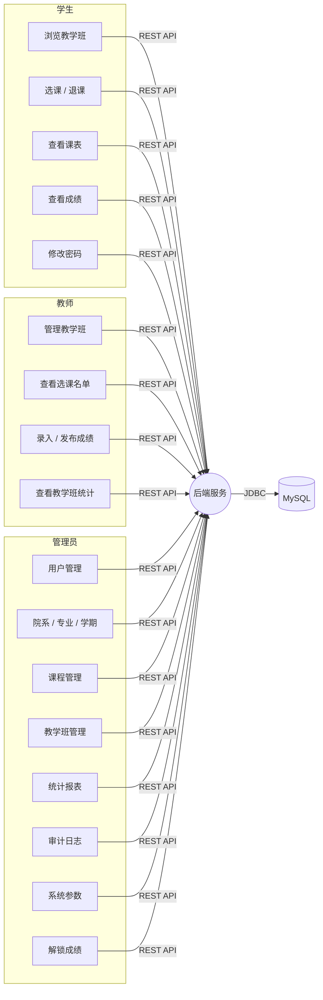

# 00 需求规格说明

| 项 | 值 |
|---|---|
| 项目名 | 基于 Spring Boot 的选课与课程管理系统（Course Selection & Management System, CSMS） |
| 版本 | v1.0（方案设计稿） |
| 上游 | `.ai/PROJECT.md` |
| 下游 | `01` `02` `03` `04` `05` `06` `07` `10` `11` |

---

## 1. 项目背景与目标

### 1.1 背景

高校教务流程中，"排课 → 学生选课 → 教师录成绩 → 统计上报"长期依赖线下表单与 Excel，存在四个具体问题：

1. **超额选课**：纸质名单先到先得，超出容量的名额靠人工剔除，容易错漏。
2. **冲突不可见**：学生常在不自知的情况下选了时间重叠的两门课，直到上课才发现。
3. **留痕缺失**：退选、改分、补录等操作无统一记录，事后无法追溯。
4. **汇总滞后**：每学期统计选课人数、专业分布、成绩分布靠人工透视表，耗时且口径不一。

### 1.2 项目目标

构建一套 Web 化的课程管理系统，覆盖 **开课 → 选课 → 成绩** 主链路，在**并发安全**、**规则可解释**、**操作可追溯**三个方向上给出工程解法。

### 1.3 成功判据（摘要，全量见 `docs/10`）

- 高并发选课不产生超卖与重复记录；
- 任一被拒绝的选课请求都返回**可读的拒绝原因**（而非 500）；
- 任意一笔成绩变更可回溯到操作人、时间与前后值；
- 选课与成绩两类核心查询在约定数据量下满足响应时间预算（见 `06` §2）。

---

## 2. 术语表

| 术语 | 定义 |
|---|---|
| 课程 `Course` | 课程目录中的抽象知识单元，如"数据结构(3学分)"，不绑定学期与教师 |
| 教学班 `TeachingClass` | 某学期由某教师开设的课程实例，**容量、时间、地点、已选人数均挂在这一层** |
| 开课 | 管理员/教师创建教学班并置为 `PUBLISHED`，学生方可选择 |
| 学期 `Term` | 如 2024-2025-1，含选课起止时间与状态 |
| 选课 `Enrollment` | 学生与教学班之间的选课关系，带状态（ enrolled / withdrawn / completed） |
| 退课 | 把选课关系置为 `WITHDRAWN`，同时释放教学班名额 |
| 预占 | 选课事务中先扣名额、写关系，中途失败必须整体回滚 |
| 学分 | 挂在课程上的学分值，学生的学期/总学分由选课关系聚合得出 |
| 成绩发布 | 教师把成绩从"草稿"变为"已发布"，之后不可自行修改 |

---

## 3. 角色与权限矩阵

系统仅设三个角色（`sys_role`），权限以"角色 + 资源 + 操作"三元组描述，实际落地见 `docs/03` §4 与 `docs/05` §2。

| 能力 | STUDENT | TEACHER | ADMIN |
|---|:---:|:---:|:---:|
| 浏览已发布教学班列表 | ✅ | ✅ | ✅ |
| 选课 / 退课 | ✅ 仅自己 | ❌ | ❌ |
| 查看选课名单 | ✅ 仅自己 | ✅ 仅自己名下教学班 | ✅ 全部 |
| 创建 / 编辑课程、教学班 | ❌ | ✅ 仅自己教学班 | ✅ 全部 |
| 录入 / 发布成绩 | ❌ | ✅ 仅自己教学班 | ✅ 全部 |
| 解锁已发布成绩 | ❌ | ❌ | ✅（留审计） |
| 维护用户 / 院系 / 专业 / 学期 | ❌ | ❌ | ✅ |
| 关闭 / 重开选课 | ❌ | ❌ | ✅ |
| 查看统计报表 | ❌ 仅个人汇总 | ✅ 本教学班汇总 | ✅ 全校汇总 |
| 查看操作审计日志 | ❌ 仅自己 | ❌ | ✅ |

**越权即拒绝原则**：任何接口在服务端依据"当前认证主体 + 资源归属"二次判定，不依赖前端隐藏入口。

---

## 4. 功能需求

编号规则：`FR-<模块>-<序号>`。

### 4.1 用户与认证模块（FR-AUTH）

| 编号 | 需求 | 优先级 |
|---|---|---|
| FR-AUTH-01 | 用户名 + 密码登录，成功返回 JWT 与用户档案（角色、姓名、院系） | P0 |
| FR-AUTH-02 | 密码使用 BCrypt 存储，任何日志与接口响应不得出现明文 | P0 |
| FR-AUTH-03 | 未携带或携带过期 Token 访问受保护接口 → 401，前端自动跳转登录并保留回跳地址 | P0 |
| FR-AUTH-04 | 无权限访问 → 403，返回明确错误码而非静默 | P0 |
| FR-AUTH-05 | 管理员可重置任意用户密码、重置后强制下次登录改密 | P1 |
| FR-AUTH-06 | 用户可修改本人密码，旧密码错误时拒绝 | P1 |
| FR-AUTH-07 | 连续登录失败 5 次锁定账号 15 分钟 | P1 |

### 4.2 基础数据模块（FR-BASE）

| 编号 | 需求 | 优先级 |
|---|---|---|
| FR-BASE-01 | 院系（Dept）增删改查，支持启用/停用 | P0 |
| FR-BASE-02 | 专业（Major）挂靠院系，含学制年限 | P1 |
| FR-BASE-03 | 学期（Term）建档，含选课开始/结束时间、状态机 | P0 |
| FR-BASE-04 | 课程（Course）含课程代码、名称、学分、学时、课程类型（必修/选修/限选）、简介、开课院系 | P0 |
| FR-BASE-05 | 课程可配置先修关系（多对多自关联） | P1 |
| FR-BASE-06 | 基础数据停用后不可被新建教学班引用，但历史数据保留 | P0 |

### 4.3 教学班管理模块（FR-CLASS）

| 编号 | 需求 | 优先级 |
|---|---|---|
| FR-CLASS-01 | 教师/管理员创建教学班：关联课程、学期、教师、上课时间地点、容量 | P0 |
| FR-CLASS-02 | 一个教学班可配置多条时间段（如每周一 1-2 节、周四 3-4 节） | P1 |
| FR-CLASS-03 | 教学班状态机：`DRAFT → PUBLISHED → CLOSED`；`DRAFT→CANCELLED`，`PUBLISHED→DRAFT` 仅管理员可回退 | P0 |
| FR-CLASS-04 | 仅 `PUBLISHED` 且在选课期内的教学班可被选 | P0 |
| FR-CLASS-05 | 教师可编辑自己教学班的基础信息；已有人选课时改容量不得低于已选人数 | P0 |
| FR-CLASS-06 | 列表支持按学期/课程/教师/院系/余量/关键词分页筛选与排序 | P0 |

### 4.4 选课模块（FR-ENROLL）

| 编号 | 需求 | 优先级 |
|---|---|---|
| FR-ENROLL-01 | 学生对教学班发起选课，服务端原子校验容量并创建选课关系 | P0 |
| FR-ENROLL-02 | 同一学生不可重复选同一教学班 | P0 |
| FR-ENROLL-03 | 校验上课时间冲突（同一学生同日时间重叠且均为有效选课） | P0 |
| FR-ENROLL-04 | 校验先修课：未满足先修关系时拒绝并指出缺哪门 | P1 |
| FR-ENROLL-05 | 退课：置状态为 `WITHDRAWN` 并释放名额；退课后可再重选同一教学班 | P0 |
| FR-ENROLL-06 | 教学班状态非 `PUBLISHED` 或超出选课期时拒绝选课 | P0 |
| FR-ENROLL-07 | 我的课表：按周视图展示，冲突课程以颜色高亮 | P1 |
| FR-ENROLL-08 | 我的成绩：按学期分组，展示学分与加权平均 | P1 |
| FR-ENROLL-09 | 每个教学班显示"剩余名额"，满员时前端置灰并显示"已满" | P1 |

### 4.5 成绩模块（FR-GRADE）

| 编号 | 需求 | 优先级 |
|---|---|---|
| FR-GRADE-01 | 教师可对名下教学班批量录入/修改成绩（平时、期中、期末、总评） | P0 |
| FR-GRADE-02 | 成绩支持批量导入（CSV/Excel），导入前预览差异，导入结果返回成功/失败明细 | P2 |
| FR-GRADE-03 | 成绩状态：`DRAFT → PUBLISHED`；发布后教师不可修改 | P0 |
| FR-GRADE-04 | 管理员可解锁已发布成绩，操作强制填写原因并写审计 | P0 |
| FR-GRADE-05 | 总评成绩自动计算（平时×30% + 期中×30% + 期末×40%，权重可配置） | P1 |
| FR-GRADE-06 | 成绩发布后自动把对应选课关系置为 `COMPLETED` | P1 |

### 4.6 统计报表模块（FR-STAT）

| 编号 | 需求 | 优先级 |
|---|---|---|
| FR-STAT-01 | 选课人数统计：按课程/教师/院系/教学班维度（表格 + 柱状图） | P1 |
| FR-STAT-02 | 满员度分析：满员教学班、闲置教学班（低于容量 30%）清单 | P1 |
| FR-STAT-03 | 学生维度：已选学分、已获学分、GPA | P1 |
| FR-STAT-04 | 成绩分布直方图（按分数段） | P2 |
| FR-STAT-05 | 统计数据实时从库中聚合，禁止使用硬编码假数据 | P0（验收硬项） |

### 4.7 系统管理模块（FR-SYS）

| 编号 | 需求 | 优先级 |
|---|---|---|
| FR-SYS-01 | 用户 CRUD、角色分配、重置密码、启用/停用 | P0 |
| FR-SYS-02 | 操作审计日志：记录操作人、角色、动作、目标、IP、前后值、时间 | P0 |
| FR-SYS-03 | 审计日志支持按操作人/动作/时间范围分页检索 | P1 |
| FR-SYS-04 | 系统参数（成绩权重、选课学分上下限）后台可配 | P2 |

---

## 4.8 用例总览图

---

## 5. 核心业务流程

### 5.1 学生选课（含失败分支）

| 步 | 主体动作 | 系统行为 | 失败分支 |
|---|---|---|---|
| 1 | 打开"课程选择"页 | 展示当前学期 `PUBLISHED` 教学班分页列表，含余量、冲突标记 | 无开放学期 → 提示"当前不在选课期" |
| 2 | 按课程名/教师/院系筛选 | 服务端分页查询 | — |
| 3 | 点击"选课" | 前端二次确认；已冲突/已满的按钮置灰 | 已满 → 禁用 |
| 4 | — | 服务端按 BR-02~BR-06 顺序校验 | 任一不满足 → 返回对应业务错误码与可读原因，**事务整体回滚，名额不扣** |
| 5 | 成功 | 返回选课关系 + 最新剩余名额 | 名额在校验后被他人抢占 → 返回"名额已满" |

### 5.2 教师发布成绩

教师进入教学班 → 选中 → 批量录入 → **暂存（DRAFT）** → 校验无空缺/无越界 → **发布（PUBLISHED）** → 系统置选课关系为 `COMPLETED` → 后续修改须管理员解锁。

### 5.3 管理员开课

维护院系/专业 → 建学期 → 建课程（含先修关系）→ 教师或管理员建教学班并填写时间地点容量 → 状态置 `PUBLISHED` → 学生侧可见。

### 5.4 退课

我的课表 → 退课 → 二次确认 → 校验是否在退课截止期与教学班是否已开课 → 关系置 `WITHDRAWN` + 名额原子释放 → 记录审计。已过截止期或已开课的，退课按钮在前端不可见，服务端同样拒绝。

---

## 6. 业务规则清单（BR）

**本节是全项目的规则唯一出处**。`03`/`05`/`07` 只能引用编号，不得改写语义。

### 6.1 选课类

| 编号 | 规则 |
|---|---|
| BR-01 | 只有状态为 `PUBLISHED` 的教学班可被选 |
| BR-02 | 只有处于选课开放期（`term.enroll_start ≤ now ≤ term.enroll_end`）的学期可被选 |
| BR-03 | 教学班已选人数必须 `< 容量`，判定与扣减必须在同一条原子 SQL 中完成 |
| BR-04 | 同一学生对同一教学班只能存在一条有效（`ENROLLED`/`COMPLETED`）的选课关系 |
| BR-05 | 同一学生不可同时选上课时间重叠的两个教学班（重叠 = 同一星期 + 时间区间相交） |
| BR-06 | 若课程配置了先修课，学生必须已存在该先修课程的 `COMPLETED` 选课关系且成绩及格（≥60） |
| BR-07 | 选课成功的判据是"关系写入 + 名额扣减"在同一事务内提交；任一失败整体回滚 |

### 6.2 退课类

| 编号 | 规则 |
|---|---|
| BR-08 | 退课仅在退课截止期前且教学班未开课时允许，否则拒绝 |
| BR-09 | 退课必须原子释放名额（`enrolled_count - 1`，下限 0） |
| BR-10 | 退课不物理删除记录，状态置 `WITHDRAWN`，保留历史以备审计与重选 |

### 6.3 成绩类

| 编号 | 规则 |
|---|---|
| BR-11 | 成绩三要素均在 [0,100] 区间，总评由权重自动计算；权重由系统参数配置 |
| BR-12 | 成绩发布后，任一方（教师）不得修改；修改必须由管理员解锁，且必须填写原因并写审计 |
| BR-13 | 成绩发布必须在一个事务内同时完成：成绩状态 → `PUBLISHED`、对应选课关系 → `COMPLETED` |

### 6.4 权限与数据类

| 编号 | 规则 |
|---|---|
| BR-14 | 任何资源级操作必须校验"当前主体是否拥有该资源的归属权"，不通过则 403 |
| BR-15 | 密码禁止明文存储与明文传输（必须 BCrypt + 强制 TLS），日志中禁止出现密码字段 |
| BR-16 | 选退课、成绩发布/解锁、基础数据增删改、登录，必须写审计日志 |

### 6.5 成绩扩展规则

| 编号 | 规则 |
|---|---|
| BR-17 | 绩点采用百分制线性映射：`total_score ≥ 60` 时 `grade_point = 1.0 + (total_score - 60) × 0.075`（60→1.0, 70→1.75, 80→2.5, 90→3.25, 100→4.0）；`< 60` 时 `grade_point = 0`。映射模式由 `sys_config` 配置项 `grade.point.mapping_mode` 控制，默认 `LINEAR` |
| BR-18 | 学生单学期选课总学分不得超过系统参数 `enroll.max_credit_per_term`（默认 30），退课后总学分不得低于 `enroll.min_credit_per_term`（默认 0） |

---

## 7. 数据需求

| 项 | 要求 |
|---|---|
| 基础数据规模 | 院系 ≤ 50、专业 ≤ 300、课程 ≤ 2000、教学班 ≤ 5000、学生 ≤ 5000（单学期） |
| 峰值并发 | 选课开放首 10 分钟内 200 QPS 峰值（见 `06` §2） |
| 历史保留 | 选课与成绩记录永久保留，不物理删除 |

---

## 8. 非功能需求（摘要）

完整版见 `docs/06`。

| 维度 | 要求 |
|---|---|
| 性能 | 列表查询 P95 < 500ms；选课提交 P95 < 800ms（含锁等待） |
| 安全 | JWT 无状态鉴权、BCrypt、参数化查询、XSS 输出转义、上传类型白名单 |
| 可用性 | 核心选课链路无单点依赖到外部服务（无 Redis 强依赖） |
| 可观测 | 结构化日志含 `traceId`；关键指标（选课成功率、被拒原因分布）可导出 |
| 兼容 | Chrome/Edge 最近两个大版本 |
| 可维护 | 模块边界清晰，核心业务规则有单元测试覆盖 |

---

## 9. 明确不在本期范围（Out of Scope）

以下功能**本版本不做**，若出现在需求变更中应评估工期：

1. 移动端 App / 小程序
2. 排考算法（教师时段冲突求解、自动排课）——本期仅做**选课时的时间冲突校验**
3. 排教室资源调度（校区/楼宇占用）
4. 选课抽签/摇号（先到先得模式之外）
5. 成绩申诉与复议流程
6. 多租户 / 多校区隔离
7. 邮件与短信通知（仅站内提示）
8. 教务对接（标准交换协议、学号主数据同步）
9. 前端 SSR / SEO 优化
10. 模型推理、AI 推荐选课

---

## 10. 待确认项与可回退假设

| 编号 | 待确认 | 可回退假设（本轮按此设计） | 影响面 |
|---|---|---|---|
| AS-01 | 课程是否需要"开课教师"之外的助教体系 | 不做助教，仅一个教师字段 | 低 |
| AS-02 | 学分是否区分必修/选修的修读要求 | 仅记录学分，不做培养方案匹配 | 低 |
| AS-05 | 退课截止期是否独立于选课截止期 | 默认取学期 `enroll_end` 作为退课截止期 | 中 |
| AS-06 | 是否需要国际化 | 仅简体中文 | 低 |

完整假设表见 `docs/11-风险与假设登记表.md`。