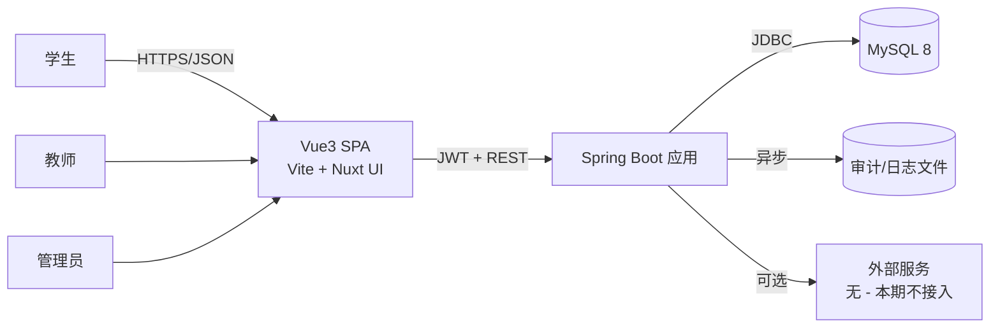
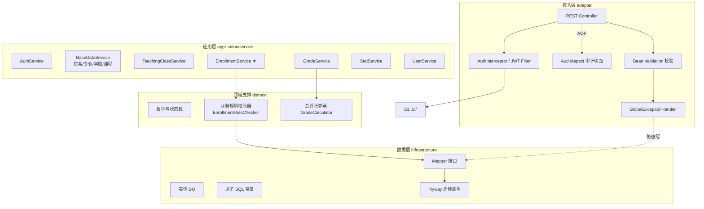
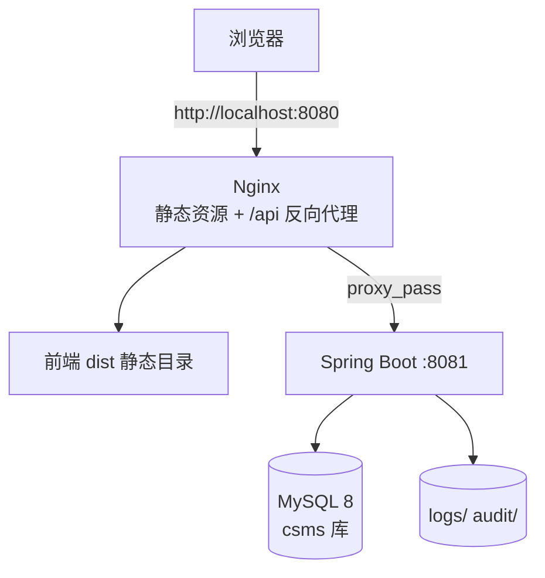

# 01 系统总体架构设计

| 项 | 值 |
|---|---|
| 上游 | `docs/00-需求规格说明.md` |
| 下游 | `02` `03` `04` `05` `06` `07` `08` |
| 定位 | 本文定义**总体结构与选型理由**，模块内部细节见 `03`，数据契约见 `02`，接口契约见 `05` |

---

## 1. 架构目标与约束

| 目标 | 落地手段 |
|---|---|
| 选课并发安全 | 容量扣减下沉到数据库单条原子语句，不依赖应用层锁（`02` §6） |
| 规则可解释 | 每个业务拒绝都有独立错误码 + 中文提示文案（`05` §4） |
| 操作可追溯 | 写操作统一经审计切面，异步落库不影响主事务成功率（`06` §4） |
| 交付可验证 | 本地 `mvn spring-boot:run` + `pnpm dev` + 本机 MySQL 即可全链路跑通，无需外部服务 |
| 不过度设计 | 单体分层 + 模块化包划分，不引入微服务 / 消息中间件 / Redis 强依赖 |

---

## 2. 系统上下文



**关键事实**：除 MySQL 外无任何外部强依赖。任何涉及 Redis、消息队列、对象存储的设计均为 P2 且可延后。

---

## 3. 架构风格选择

| 方案 | 结论 | 理由 |
|---|---|---|
| 单体分层（Controller-Service-Mapper） | ✅ **采用** | 教务业务边界清晰、并发正确性依赖数据库事务，单体内事务边界最可靠；团队规模小，易测试易交付 |
| 模块化单体（Maven 多模块） | ⚠️ 部分采用 | 不拆 Maven 模块（增加构建复杂度），改为**包级模块化** + 每个模块独立 `xxx/` 包与独立的 Service/Mapper |
| 微服务 | ❌ 不采用 | 选课强一致场景引入分布式事务得不偿失，远超本次规模需要 |
| CQRS / 事件驱动 | ❌ 不采用 | 仅审计事件走异步线程，不引入消息中间件 |

---

## 4. 技术选型与理由

> **版本口径**：下表只写"大版本 + 理由"。**实施时以 Maven Central / npm registry 实际解析到的版本为准**（原因见 `docs/11` AS-02）。

| 层 | 选型 | 备选 | 选择理由 |
|---|---|---|---|
| 语言/运行时 | Java 21 LTS | Java 17；本机实测有 JDK 17 与 JDK 26 | Spring Boot 3.x 官方基线；本机 JAVA_HOME 指向 JDK 26（非 LTS），若与 Boot 3.x 编译目标冲突，**回退到 JDK 17**（AS-04） |
| 后端框架 | Spring Boot 3.x（Web / Validation / Actuator） | Spring MVC 裸写 | 约定优于配置、测试切片（`@WebMvcTest`/`@DataJpaTest` 等）大幅降低测试成本 |
| 安全 | Spring Security 6 + JJWT | Shiro；自研拦截器 | 官方维护、过滤器链模型清晰、可测 |
| 持久层 | **MyBatis-Plus** + 显式 SQL | Spring Data JPA | 选课原子更新、满员度/成绩分布聚合需要手写 SQL；JPA 在此需 `@Version` 或悲观锁，控制力弱 |
| 迁移 | Flyway | `schema.sql` 自动初始化 | 版本化、可重复执行、可校验 checksum |
| 数据库 | MySQL 8.x InnoDB utf8mb4 | PostgreSQL | 本机已有 MySQL 8.3，零安装成本 |
| 连接池 | HikariCP（默认） | Druid | Boot 默认，监控指标已接入 Actuator |
| 缓存 | **无独立缓存中间件** | Redis | 选课强一致场景下缓存易引入不一致；用短 TTL 的本地缓存仅做统计类查询加速（`06` §3） |
| 前端框架 | Vue 3 Composition API + `<script setup>` | Options API | 组合式逻辑复用，团队与教程生态一致 |
| 构建 | Vite | Webpack / Nuxt SSR | 冷启动快、配置简单；教务系统无 SEO 需求（`00` §9.9） |
| UI | **Nuxt UI**（Tailwind CSS 基础） | Element Plus / Naive UI | 用户指定（`PROJECT.md` §3）。接入方式见 `04` §1 选型口径与 AS-03 |
| 路由/状态 | Vue Router 4 + Pinia | Vuex | 官方当前推荐 |
| HTTP | Axios + 请求/响应拦截器 | fetch | 拦截器统一处理 Token 刷新与错误提示 |
| 图表 | ECharts | — | 统计看板需求（FR-STAT-01/04） |
| 测试 | JUnit5 + Mockito + Testcontainers + MockMvc + Vitest + Playwright | — | 并发测试需**真实 MySQL**，Testcontainers 是唯一可靠方案 |

---

## 5. 逻辑架构（后端分层）



**★ 核心模块 = EnrollmentService**。它承担选课事务、三重规则校验（BR-04/05/06）、容量原子扣减（BR-03）与退课释放（BR-09），是全系统复杂度与风险最集中的地方，`03` §3.3 给出完整时序。

### 5.1 分层依赖铁律

1. 依赖只能单向向下：`L1 → L2 → L3 → L4`，**禁止反向与跨层跳跃**（Service 不得直接持有 Mapper，Mapper 层不出现业务判断）。
2. Controller **零业务逻辑**：只做参数绑定、校验注解、调用 Service、组装响应。
3. 状态枚举与规则校验器（`domain`）是**无状态单例**，便于单元测试直接实例化。
4. 跨模块调用只能通过对方的 Service 接口，禁止直接访问对方 Mapper。

---

## 6. 模块划分（包级）

| 模块 | 归属包 | 对应 FR | 核心表 |
|---|---|---|---|
| `auth` 认证 | `com.csms.auth` | FR-AUTH-* | `sys_user` `sys_role` `sys_user_role` |
| `user` 用户 | `com.csms.user` | FR-SYS-01 | `sys_user` |
| `base` 基础数据 | `com.csms.base` | FR-BASE-* | `dept` `major` `term` `course` `course_prereq` |
| `class` 教学班 | `com.csms.classroom` | FR-CLASS-* | `teaching_class` `class_schedule` |
| `enroll` 选课 | `com.csms.enroll` | FR-ENROLL-* | `enrollment` |
| `grade` 成绩 | `com.csms.grade` | FR-GRADE-* | `grade` |
| `stat` 统计 | `com.csms.stat` | FR-STAT-* | 跨表只读聚合 |
| `audit` 审计 | `com.csms.audit` | FR-SYS-02 | `sys_audit_log` |
| `common` 公共 | `com.csms.common` | — | 分页包装、错误码、上下文持有器、工具 |

> 包名 `classroom` 而非 `class`：`class` 是 Java 关键字，不能作包名。

---

## 7. 工程目录结构

### 7.1 后端

```
backend/
├─ pom.xml
├─ .mvn/                       # Maven wrapper（保证版本一致）
├─ mvnw / mvnw.cmd
└─ src/
   ├─ main/
   │  ├─ java/com/csms/
   │  │  ├─ CmsApplication.java
   │  │  ├─ common/
   │  │  │  ├─ api/          # ApiResponse, PageResult, PageQuery
   │  │  │  ├─ error/        # BizException, ErrorCode
   │  │  │  ├─ context/      # CurrentUserHolder (ThreadLocal)
   │  │  │  ├─ config/       # MybatisPlusConfig, WebMvcConfig, JacksonConfig, OpenApiConfig
   │  │  │  └─ util/
   │  │  ├─ security/        # JwtFilter, JwtService, SecurityConfig, AuthPrincipal
   │  │  ├─ auth/  user/  base/  classroom/  enroll/  grade/  stat/  audit/
   │  └─ resources/
   │     ├─ application.yml            # 公共配置
   │     ├─ application-dev.yml        # 本地开发
   │     ├─ application-test.yml       # 集成测试（Testcontainers 注入 URL）
   │     ├─ db/migration/              # Flyway：V1__init_schema.sql, V2__init_data.sql ...
   │     └─ mapper/                    # MyBatis XML（仅复杂联表/聚合）
   └─ test/
      ├─ java/com/csms/  ...           # 单测 / 集成测试
      └─ resources/
```

### 7.2 前端

```
frontend/
├─ package.json / pnpm-lock.yaml / vite.config.ts / tsconfig.json
├─ index.html
├─ .env.development           # VITE_API_BASE_URL
├─ .env.production
├─ public/
└─ src/
   ├─ main.ts                 # createApp + pinia + router + ui 插件
   ├─ App.vue                 # UApp 外壳 + 全局错误边界
   ├─ api/                    # 按模块封装 axios 调用
   │  ├─ request.ts           # 实例 + 拦截器（注入 Token、401 处理、错误提示）
   │  ├─ auth.ts  base.ts  classroom.ts  enroll.ts  grade.ts  stat.ts  user.ts
   │  └─ types.ts             # 与 docs/05 一致的 TS 类型
   ├─ router/index.ts         # 路由表 + 守卫（见 docs/04 §4）
   ├─ stores/                 # auth.ts  user.ts  term.ts  enroll.ts  dict.ts
   ├─ layouts/                # DefaultLayout.vue  AuthLayout.vue
   ├─ components/             # 通用组件（见 docs/04 §5）
   ├─ views/
   │  ├─ auth/LoginView.vue
   │  ├─ student/  teacher/  admin/   # 按角色分目录
   │  └─ error/NotFound.vue  Forbidden.vue
   ├─ composables/            # usePagination, useTableQuery, useDialog
   ├─ directives/             # v-perm（按钮级权限）
   ├─ utils/
   ├─ types/
   └─ styles/                 # tailwind 入口 + 主题变量
```

---

## 8. 前端路由与布局的一级分区

| 前缀 | 布局 | 可访问角色 |
|---|---|---|
| `/login` | `AuthLayout` | 公开 |
| `/student/**` | `DefaultLayout` | `STUDENT` |
| `/teacher/**` | `DefaultLayout` | `TEACHER` |
| `/admin/**` | `AdminLayout` | `ADMIN` |
| `/403` `/404` | 独立 | 登录后 |

三角色共享的业务页面（如"课程浏览"）通过**角色可见性**而非复制页面实现，避免重复代码。

---

## 9. 部署拓扑



- **开发期**：Vite dev server `:5173` + 后端 `:8081`，前端通过 Vite `server.proxy` 转发 `/api`，规避跨域。
- **生产/演示期**：Nginx 同时承担静态托管与反代，**同源部署，无需 CORS**。
- 详细编排见 `docs/08`。

---

## 10. 跨层契约摘要（详见 `05`）

| 项 | 约定 |
|---|---|
| 响应体 | `{ code:int, message:string, data:T, traceId:string }`，`code=0` 成功 |
| 分页请求 | `page`(从 1 起)、`size`、`sortBy`、`sortOrder` |
| 分页响应 | `data.records / total / page / size / pages` |
| 鉴权 | `Authorization: Bearer <JWT>`；JWT 含 `userId/username/role/deptId` |
| 错误 | HTTP 状态码表达大类（400/401/403/404/409/500），`code` 表达具体业务原因 |
| 时间 | API 传输统一 `yyyy-MM-dd HH:mm:ss`；DB 存储 `DATETIME` |
| 时间冲突比较 | 以"星期几 + 起始/结束节次（分钟数）"判定区间相交 |

---

## 11. 架构决策记录（ADR 摘要）

| ADR | 决策 | 备选 | 后果 |
|---|---|---|---|
| ADR-01 | 单体分层 + 包级模块化 | 微服务 | 事务可靠、开发快；边界靠规范约束而非编译期强制 |
| ADR-02 | 容量扣减用单条原子 UPDATE | 悲观锁 / 分布式锁 | 无锁等待；需以受影响行数判定成功（`02` §6） |
| ADR-03 | MyBatis-Plus 而非 JPA | JPA | SQL 可控、聚合查询直观；失去部分 ORM 便利 |
| ADR-04 | 无状态 JWT，无服务端 Session | Session | 水平扩展容易；需处理 Token 失效（短有效期 + 刷新） |
| ADR-05 | 不引入 Redis/消息中间件 | 引入 | 部署最简；统计数据量大时需靠索引与分页兜底（已知上限见 `06` §2） |
| ADR-06 | 审计异步写入（线程池） | 同步写 | 主链路不受审计失败影响；接受极端崩溃可能丢最后几条审计（风险登记 RISK-05） |
| ADR-07 | 前端 SPA，不上 Nuxt SSR | Nuxt 全家桶 | 构建简单、无 SEO 需求；登录后应用本就无需 SSR（`00` §9.9） |