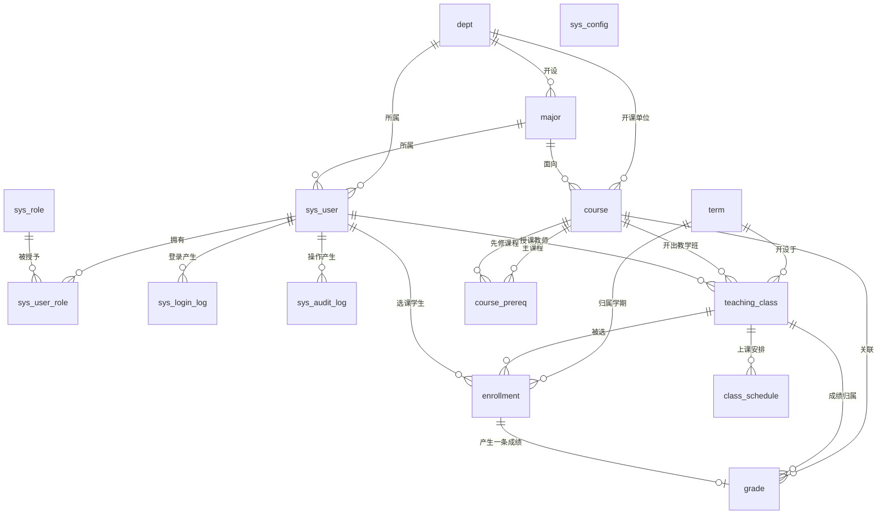

# 02 数据库设计

| 项 | 值 |
|---|---|
| 上游 | `docs/00`（BR 规则）、`docs/01`（分层） |
| 下游 | `docs/03` `docs/04` `docs/05` `docs/06` `docs/07` |
| 地位 | **全项目数据契约的唯一出处**。下游文档只能引用表名/字段名，不得重定义 |

> 本文档给出**设计级**表结构定义（字段、类型、约束、索引、说明），不含可执行 DDL。DDL 与迁移脚本是编码阶段（`TASKS.md` C-1）的交付物，由 Flyway 脚本承载。

---

## 1. 设计原则

| 原则 | 说明 |
|---|---|
| 单库单实例 | 单个 MySQL 8 实例、单个 `csms` 库；不读写分离、不分库分表 |
| 适度冗余 | 允许 `teaching_class.enrolled_count` 这类**必须原子维护**的冗余，以换取并发正确性与读取性能；冗余项必须可校验、可修复（§7） |
| 逻辑删除 | 业务主数据（用户、院系、专业、课程、教学班）用 `deleted` 标记；**流水数据（选课、成绩、审计、登录日志）物理保留不删** |
| 枚举显式 | 所有状态字段取值集中于 §6 枚举注册表，代码与文档不得各写一套 |
| 无外键约束 | 应用层保证引用完整性（教务场景存在批量导入与历史追溯，外键会显著拖慢写入并阻碍数据修正） |
| 时间统一 | 库内 `DATETIME`，应用层 `Asia/Shanghai`，API 传输 `yyyy-MM-dd HH:mm:ss` |

---

## 2. 通用字段规范

| 字段 | 类型 | 说明 |
|---|---|---|
| `id` | `BIGINT UNSIGNED` AUTO_INCREMENT | 主键；对外接口一律以字符串返回（避免前端精度丢失） |
| `created_at` / `updated_at` | `DATETIME` | 由应用层填充（`MetaObjectHandler`） |
| `created_by` / `updated_by` | `BIGINT UNSIGNED` | 操作人 `sys_user.id` |
| `deleted` | `TINYINT` DEFAULT 0 | 0 正常 / 1 删除；查询默认过滤 |
| `version` | `INT` DEFAULT 0 | 乐观锁，仅用于确有必要的主数据（选课计数不走乐观锁，见 §6） |

字符集统一 `utf8mb4` / `utf8mb4_general_ci`；引擎统一 `InnoDB`。

---

## 3. ER 图



---

## 4. 表清单总览

| # | 表名 | 中文名 | 量级预估 | 写入频率 |
|---|---|---|---|---|
| 1 | `sys_user` | 用户 | 1 万 | 低 |
| 2 | `sys_role` | 角色 | 3 | 极低 |
| 3 | `sys_user_role` | 用户角色关联 | 1 万 | 低 |
| 4 | `sys_login_log` | 登录日志 | 百万级 | 高 |
| 5 | `sys_audit_log` | 操作审计 | 百万级 | 中 |
| 6 | `sys_config` | 系统参数 | 20 | 极低 |
| 7 | `dept` | 院系 | 50 | 低 |
| 8 | `major` | 专业 | 300 | 低 |
| 9 | `term` | 学期 | 100 | 极低 |
| 10 | `course` | 课程 | 2000 | 低 |
| 11 | `course_prereq` | 课程先修关系 | 5000 | 低 |
| 12 | `teaching_class` | 教学班 | 5000 | 低 |
| 13 | `class_schedule` | 上课时间段 | 1 万 | 低 |
| 14 | `enrollment` | 选课关系 | 50 万 | **高** |
| 15 | `grade` | 成绩 | 50 万 | 中 |

---

## 5. 表结构定义

### 5.1 `sys_user` 用户

| 字段 | 类型 | 约束 | 说明 |
|---|---|---|---|
| `id` | BIGINT UNSIGNED | PK | |
| `username` | VARCHAR(50) | NOT NULL, **UK** | 登录名（学号/工号） |
| `password` | VARCHAR(100) | NOT NULL | BCrypt 密文，长度 60，列宽留扩展 |
| `real_name` | VARCHAR(50) | NOT NULL | 姓名 |
| `user_type` | VARCHAR(16) | NOT NULL | `STUDENT`/`TEACHER`/`ADMIN` |
| `dept_id` | BIGINT UNSIGNED | NULL | 所属院系 |
| `major_id` | BIGINT UNSIGNED | NULL | 所属专业（学生） |
| `gender` | VARCHAR(8) | NULL | `MALE`/`FEMALE`/`UNKNOWN` |
| `phone` | VARCHAR(20) | NULL | 加密或脱敏存储（`06` §3） |
| `email` | VARCHAR(100) | NULL | |
| `status` | VARCHAR(16) | NOT NULL, D `ACTIVE` | `ACTIVE`/`DISABLED` |
| `must_change_pwd` | TINYINT | D 0 | 是否强制改密 |
| `fail_count` | INT | D 0 | 连续登录失败次数（FR-AUTH-07） |
| `lock_until` | DATETIME | NULL | 锁定截止时间 |
| `last_login_at` | DATETIME | NULL | |
| `created_at/updated_at/created_by/updated_by/deleted` | | | 通用字段 |

索引：`uk_user_username(username)`（**单列唯一**，保证登录语义绝对唯一，见下方说明）、`idx_user_dept(dept_id)`、`idx_user_major(major_id)`、`idx_user_type(user_type)`

> **软删与唯一键的权衡**：用户名唯一索引若为单列 `username`，软删用户后无法重建同名账号。本期选择**单列唯一**（保证登录语义绝对唯一），软删用户需先改用户名后缀（如 `20240101_已注销`）。取舍理由见 `docs/11` RISK-02。

### 5.2 `sys_role` 角色

| 字段 | 类型 | 约束 | 说明 |
|---|---|---|---|
| `id` | BIGINT UNSIGNED | PK | |
| `code` | VARCHAR(32) | NOT NULL, **UK** | `STUDENT`/`TEACHER`/`ADMIN` |
| `name` | VARCHAR(32) | NOT NULL | 学生/教师/管理员 |
| `description` | VARCHAR(200) | NULL | |
| `builtin` | TINYINT | D 0 | 是否内置，内置角色禁止删除 |
| `created_at/updated_at/deleted` | | | |

### 5.3 `sys_user_role` 用户角色关联

| 字段 | 类型 | 约束 | 说明 |
|---|---|---|---|
| `id` | BIGINT UNSIGNED | PK | |
| `user_id` | BIGINT UNSIGNED | NOT NULL | →`sys_user.id` |
| `role_id` | BIGINT UNSIGNED | NOT NULL | →`sys_role.id` |
| `created_at` | | | |

索引：`uk_user_role(user_id, role_id)`、`idx_uar_role(role_id)`

> 本期**一人一角色**（`user_type` 与角色一一对应）。采用关联表而非在 `sys_user` 上放 `role_id`，是为后续支持"教师兼学生"留出扩展位（AS-01）。

### 5.4 `sys_login_log` 登录日志

| 字段 | 类型 | 说明 |
|---|---|---|
| `id` | BIGINT UNSIGNED | PK |
| `username` | VARCHAR(50) | 尝试登录的用户名（失败时可能不存在用户，故不设外键） |
| `user_id` | BIGINT UNSIGNED | 成功时写入 |
| `ip` | VARCHAR(45) | 兼容 IPv6 |
| `user_agent` | VARCHAR(300) | |
| `result` | VARCHAR(16) | `SUCCESS`/`BAD_PASSWORD`/`USER_NOT_FOUND`/`DISABLED`/`LOCKED` |
| `login_at` | DATETIME | |

索引：`idx_login_username_time(username, login_at)`、`idx_login_time(login_at)`
策略：保留 180 天后归档删除（`06` §5）。

### 5.5 `sys_audit_log` 操作审计

| 字段 | 类型 | 说明 |
|---|---|---|
| `id` | BIGINT UNSIGNED | PK |
| `user_id` / `username` | BIGINT UNSIGNED / VARCHAR(50) | 操作人快照（用户改名/删除后仍可查） |
| `role_code` | VARCHAR(16) | 角色快照 |
| `module` | VARCHAR(32) | `AUTH`/`BASE`/`CLASS`/`ENROLL`/`GRADE`/`USER` |
| `action` | VARCHAR(64) | 动作码，如 `ENROLL_CREATE`、`GRADE_PUBLISH`、`GRADE_UNLOCK` |
| `target_type` | VARCHAR(32) | `TEACHING_CLASS`/`COURSE`/`ENROLLMENT`… |
| `target_id` | BIGINT UNSIGNED | |
| `before_json` / `after_json` | JSON / NULL | 变更前后值（**密码、令牌字段必须脱敏剔除**） |
| `result` | VARCHAR(16) | `SUCCESS`/`FAIL` |
| `ip` | VARCHAR(45) | |
| `trace_id` | VARCHAR(32) | 与 `05` 响应体中的 traceId 对齐 |
| `created_at` | DATETIME | |

索引：`idx_audit_user_time(user_id, created_at)`、`idx_audit_action(action, created_at)`、`idx_audit_target(target_type, target_id)`、`idx_audit_time(created_at)`

### 5.6 `sys_config` 系统参数

| 字段 | 类型 | 说明 |
|---|---|---|
| `id` | BIGINT UNSIGNED | PK |
| `config_key` | VARCHAR(64) | **UK**，`grade.weight.regular` 等 |
| `config_value` | VARCHAR(255) | |
| `value_type` | VARCHAR(16) | `STRING`/`NUMBER`/`BOOL`/`JSON` |
| `description` | VARCHAR(200) | |
| `editable` | TINYINT | 内置项是否可改 |

内置项：`grade.weight.regular=0.3`、`grade.weight.midterm=0.3`、`grade.weight.final=0.4`、`grade.pass_score=60`、`grade.point.mapping_mode=LINEAR`（BR-17）、`enroll.max_credit_per_term=30`、`enroll.min_credit_per_term=0`、`enroll.withdraw_deadline_mode=TERM_ENROLL_END`。

### 5.7 `dept` 院系

| 字段 | 类型 | 说明 |
|---|---|---|
| `id` | BIGINT UNSIGNED | PK |
| `code` | VARCHAR(32) | **UK** 院系代码 |
| `name` | VARCHAR(64) | 院系名称 |
| `leader` | VARCHAR(50) | 负责人姓名 |
| `status` | VARCHAR(16) | `ACTIVE`/`DISABLED` |
| `sort_no` | INT | 排序号 |
| 通用字段 | | |

### 5.8 `major` 专业

| 字段 | 类型 | 说明 |
|---|---|---|
| `id` | BIGINT UNSIGNED | PK |
| `dept_id` | BIGINT UNSIGNED | NOT NULL，→`dept.id` |
| `code` | VARCHAR(32) | **UK** |
| `name` | VARCHAR(64) | |
| `degree_years` | TINYINT | 学制年限 |
| `status` | VARCHAR(16) | `ACTIVE`/`DISABLED` |
| 通用字段 | | |

索引：`idx_major_dept(dept_id)`

### 5.9 `term` 学期

| 字段 | 类型 | 说明 |
|---|---|---|
| `id` | BIGINT UNSIGNED | PK |
| `code` | VARCHAR(32) | **UK**，`2024-2025-1` |
| `name` | VARCHAR(64) | 2024-2025学年第1学期 |
| `start_date` / `end_date` | DATE | 学期起止 |
| `enroll_start` / `enroll_end` | DATETIME | **选课窗口**（BR-02 依据） |
| `withdraw_end` | DATETIME | 退课截止（AS-05 默认等于 `enroll_end`） |
| `status` | VARCHAR(16) | `PLANNED`/`ENROLLING`/`RUNNING`/`CLOSED` |
| 通用字段 | | |

> 选课窗口不从 `start_date` 推断，而是**独立字段**，允许提前开放选课或延后。

### 5.10 `course` 课程

| 字段 | 类型 | 说明 |
|---|---| |
| `id` | BIGINT UNSIGNED | PK |
| `course_code` | VARCHAR(32) | **UK** 课程代码 |
| `name` | VARCHAR(100) | 课程名 |
| `credit` | DECIMAL(3,1) | 学分（支持 0.5 粒度） |
| `credit_hours` | INT | 总学时 |
| `course_type` | VARCHAR(16) | `REQUIRED`必修/`ELECTIVE`选修/`RESTRICTED`限选 |
| `dept_id` | BIGINT UNSIGNED | 开课单位 |
| `major_id` | BIGINT UNSIGNED | 面向专业（可空=通用） |
| `description` | VARCHAR(1000) | 课程简介 |
| `status` | VARCHAR(16) | `ACTIVE`/`DISABLED` |
| 通用字段 | | |

索引：`idx_course_dept(dept_id)`、`idx_course_name(name)`（列表关键词检索）、`idx_course_status(status)`

### 5.11 `course_prereq` 课程先修关系

| 字段 | 类型 | 说明 |
|---|---|---|
| `id` | BIGINT UNSIGNED | PK |
| `course_id` | BIGINT UNSIGNED | 后续课程 |
| `prereq_course_id` | BIGINT UNSIGNED | 先修课程 |
| `requirement` | VARCHAR(16) | `REQUIRED`必先修 / `ONE_OF`（预留） |

索引：**UK `(course_id, prereq_course_id)`**、`idx_prereq_reverse(prereq_course_id)`

> 加 `course_id` 在前的联合唯一索引，直接服务于 BR-06 的"查某课程的全部先修项"。

### 5.12 `teaching_class` 教学班（核心表）

| 字段 | 类型 | 说明 |
|---|---|---|
| `id` | BIGINT UNSIGNED | PK |
| `course_id` | BIGINT UNSIGNED | NOT NULL |
| `term_id` | BIGINT UNSIGNED | NOT NULL |
| `teacher_id` | BIGINT UNSIGNED | NOT NULL，授课教师 `sys_user.id` |
| `assistant_ids` | VARCHAR(200) | 预留，逗号分隔（AS-01 本期不用） |
| `class_name` | VARCHAR(64) | 班号，如"数据结构(1)班" |
| `capacity` | INT | 容量（BR-03） |
| `enrolled_count` | INT | D 0，已选人数（**冗余**，原子维护） |
| `credit` | DECIMAL(3,1) | 冗余学期分便于列表免联表，允许与课程分不一致（以课程为准，导入时校验） |
| `location` | VARCHAR(100) | 默认上课地点 |
| `start_week` / `end_week` | TINYINT | 第几周 ~ 第几周 |
| `open_class_date` | DATE | 开课日期（BR-08 退课限制依据） |
| `status` | VARCHAR(16) | `DRAFT`/`PUBLISHED`/`CLOSED`/`CANCELLED` |
| `capacity_full_enabled` | TINYINT | 是否启用候补（预留，默认 0） |
| `description` | VARCHAR(500) | 选课说明 |
| 通用字段 | | |

索引：
- `idx_tc_term_status(term_id, status)` — **列表主查询**
- `idx_tc_course(course_id)`
- `idx_tc_teacher(teacher_id, term_id)` — 教师"我的教学班"
- `idx_tc_term_course(term_id, course_id)` — 统计

### 5.13 `class_schedule` 上课时间段

| 字段 | 类型 | 说明 |
|---|---|---|
| `id` | BIGINT UNSIGNED | PK |
| `teaching_class_id` | BIGINT UNSIGNED | NOT NULL |
| `day_of_week` | TINYINT | 1=周一 … 7=周日（**统一用 1-7，禁止用 0/7 混用**） |
| `start_section` | SMALLINT | 起始节次 |
| `end_section` | SMALLINT | 结束节次（≥ start） |
| `start_minute` | INT | 折算为当日零点起的分钟数，**BR-05 冲突判定的比较基准** |
| `end_minute` | INT | 同上 |
| `location` | VARCHAR(100) | 该时间段教室 |
| `week_desc` | VARCHAR(64) | 展示用，如"第1-9周" |
| `start_week` | TINYINT | 起始周次（默认 1），冲突检测的周次比较基准 |
| `end_week` | TINYINT | 结束周次（默认教学班的 `end_week`），`≥ start_week` |

索引：`idx_sched_class(teaching_class_id)`、`idx_sched_day_week(day_of_week, start_week, end_week, start_minute, end_minute)`

> 冗余存储 `start_minute/end_minute` 是刻意的：避免每次冲突检测都做节次→分钟换算函数计算；换算表由后端常量统一提供（`03` §3.3）。

### 5.14 `enrollment` 选课关系（核心表）

| 字段 | 类型 | 说明 |
|---|---|---|
| `id` | BIGINT UNSIGNED | PK |
| `student_id` | BIGINT UNSIGNED | NOT NULL，→`sys_user.id`（`user_type=STUDENT`） |
| `teaching_class_id` | BIGINT UNSIGNED | NOT NULL |
| `course_id` | BIGINT UNSIGNED | 冗余，便于统计免联表 |
| `term_id` | BIGINT UNSIGNED | 冗余，同上 |
| `credit` | DECIMAL(3,1) | **冗余快照**：选课当时的学分，不随课程后续修改而变（保住历史成绩单） |
| `status` | VARCHAR(16) | `ENROLLED`/`WITHDRAWN`/`COMPLETED`（**BR-10：不物理删除**） |
| `enrolled_at` | DATETIME | 选课时间 |
| `withdrawn_at` | DATETIME | 退课时间 |
| `grade_id` | BIGINT UNSIGNED | NULL，对应成绩（也可由 `grade.enrollment_id` 反查，二选一，本设计以 `grade.enrollment_id` 为准，本列保留） |
| `source` | VARCHAR(16) | `PORTAL`/`ADMIN`（管理员代选） |
| `remark` | VARCHAR(200) | |
| `created_at/updated_at/deleted` | | 无 `created_by` 语义变化 |

索引：
- **UK `uk_enroll_student_class(student_id, teaching_class_id)`** — BR-04 的强制手段（物理唯一，不依赖应用判断）
- `idx_enroll_class_status(teaching_class_id, status)` — 名额核对、学生名单
- `idx_enroll_student_status(student_id, status)` — **我的课表 / 冲突检测 / 先修课检测主查询**
- `idx_enroll_term_term(term_id, status)` — 统计

> **注**：同一学生多次退选重选同一教学班时，本表仅保留最后一次状态覆盖（依靠唯一键 `UPDATE`）。复杂的退选历史追踪依赖 `sys_audit_log` 兜底；后续若需独立分析可选路径，可引入 `enrollment_history` 事件表（P2 优化）。

### 5.15 `grade` 成绩

| 字段 | 类型 | 说明 |
|---|---|---|
| `id` | BIGINT UNSIGNED | PK |
| `enrollment_id` | BIGINT UNSIGNED | NOT NULL, **UK** → `enrollment.id`（一人一班一条） |
| `teaching_class_id` | BIGINT UNSIGNED | 冗余 |
| `student_id` | BIGINT UNSIGNED | 冗余，统计免联表 |
| `course_id` / `term_id` | BIGINT UNSIGNED | 冗余 |
| `regular_score` | DECIMAL(5,2) | 平时成绩 |
| `midterm_score` | DECIMAL(5,2) | 期中成绩 |
| `final_score` | DECIMAL(5,2) | 期末成绩 |
| `total_score` | DECIMAL(5,2) | 总评，`DECIMAL` 避免浮点误差（BR-11） |
| `grade_point` | DECIMAL(4,2) | 绩点，发布时计算 |
| `is_pass` | TINYINT | 是否及格 |
| `status` | VARCHAR(16) | `DRAFT`/`PUBLISHED`（BR-12） |
| `published_at` | DATETIME | 发布时刻 |
| `published_by` | BIGINT UNSIGNED | 发布人 |
| `unlock_count` | INT | D 0，被管理员解锁次数 |
| `last_unlock_reason` | VARCHAR(300) | 最近一次解锁原因 |
| `created_at/updated_at/created_by/updated_by/deleted` | | |

索引：`idx_grade_class(teaching_class_id, status)`、`idx_grade_student(student_id, term_id)`

---

## 6. 并发与事务设计（**全库最关键的一节**）

### 6.1 问题

"检查剩余名额 → 扣减 → 写选课记录"若拆成三条语句，两个并发请求会同时通过检查，造成超卖。

### 6.2 方案：单条原子 UPDATE + 受影响行数判定

**核心语句（语义描述，实际 SQL 在编码阶段随 Flyway/Mapper 落地）：**

```
-- 条件更新：仅当"状态可选 且 仍有剩余名额"时才会影响 1 行
UPDATE teaching_class
   SET enrolled_count = enrolled_count + 1,
       updated_at = ?, updated_by = ?
 WHERE id = ?
   AND deleted = 0
   AND status = 'PUBLISHED'
   AND enrolled_count < capacity;
-- 影响行数 == 1  →  预占成功
-- 影响行数 == 0  →  预占失败（班不存在 / 状态不对 / 已被抢满）
```

- InnoDB 行锁在 `WHERE` 命中行上生效，`enrolled_count < capacity` 的判断与自增在**同一条语句、同一个行锁保护下**完成，不存在检查-执行间隙。
- **禁止**把条件判断拆成"先 SELECT 再 UPDATE"的写法。

### 6.3 选课完整事务（`03` §3.3 给出时序图）

| 步 | 动作 | 事务内 |
|---|---|---|
| 1 | 校验学生状态、选课窗口（BR-02） | 事务内读 |
| 2 | 校验重复选课（BR-04） | 事务内读（唯一键为最终保证） |
| 3 | 校验时间冲突（BR-05） | 事务内读 `enrollment JOIN class_schedule` |
| 4 | 校验先修课（BR-06） | 事务内读 |
| 5 | **原子预占名额**（BR-03） | 写 |
| 6 | 插入 `enrollment`（`ENROLLED`） | 写 |
| 7 | 写审计（异步，不阻断） | 事务外 |

- **隔离级别**：连接级设为 `READ COMMITTED`。RR 下 `enrollment` 的范围查询会加间隙锁，选课高峰易死锁；RC 减少锁范围，原子 UPDATE 的正确性不依赖隔离级别。
- **死锁策略**：捕获 `DeadlockLoserDataAccessException` / `CannotAcquireLockException`，**最多重试 2 次**（间隔 50ms/200ms 随机抖动），仍失败则返回可读错误码而非 500。
- **顺序固定**：所有涉及教学班的写操作统一先锁 `teaching_class` 再锁 `enrollment`，杜绝交叉加锁。

### 6.4 退课事务（BR-08/09/10）

```
BEGIN
  1. SELECT ... FROM enrollment WHERE student_id=? AND teaching_class_id=? AND status='ENROLLED' FOR UPDATE
  2. 校验退课截止与开课日期（BR-08）→ 不满足则 ROLLBACK
  3. UPDATE enrollment SET status='WITHDRAWN', withdrawn_at=... WHERE id=?
  4. UPDATE teaching_class SET enrolled_count = GREATEST(enrolled_count - 1, 0) WHERE id=?
COMMIT
```

`GREATEST` 兜底：即使出现计数异常也不产生负数，且能自愈到 0。

### 6.5 成绩发布事务（BR-12/13）

```
BEGIN
  1. SELECT grade ... FOR UPDATE（幂等前提）
  2. 断言 grade.status='DRAFT'，否则拒绝（发布幂等：已是 PUBLISHED 返回成功 + 提示"已发布"）
  3. UPDATE grade SET status='PUBLISHED', published_at, published_by, total_score, grade_point
  4. UPDATE enrollment SET status='COMPLETED' WHERE teaching_class_id=? AND status='ENROLLED'
COMMIT
```

### 6.6 唯一键与并发冲突的映射

| 数据库异常 | 业务含义 | 对外返回 |
|---|---|---|
| `uk_enroll_student_class` 冲突 | 重复选课（BR-04） | `ENROLL_DUPLICATED` (409) |
| 原子 UPDATE 影响 0 行 | 名额已满 / 状态不可选（BR-01/03） | `ENROLL_FULL` (409) |
| 死锁（重试后仍失败） | 系统繁忙 | `SYS_BUSY` (503) |

**必须捕获并翻译为业务错误码**，禁止把 `DuplicateKeyException`、`SQLException` 直接抛给前端（`03` §5）。

### 6.7 名额一致性校验（冗余字段的兜底）

允许通过 `ADMIN + 手动核对 SQL` 或一个定时任务每日凌晨对账：

```
-- 找出 enrolled_count 与真实有效选课数不一致的教学班
SELECT tc.id, tc.enrolled_count,
       (SELECT COUNT(*) FROM enrollment e
         WHERE e.teaching_class_id = tc.id
           AND e.status IN ('ENROLLED','COMPLETED')) AS real_count
  FROM teaching_class tc
 WHERE tc.deleted = 0
   AND tc.enrolled_count <> ( ...同上... );
```

验收要求：选课压测结束后该查询**必须返回 0 行**（`10` AC-07）。

---

## 7. 枚举注册表（**唯一定义处**）

| 枚举 | 取值 |
|---|---|
| `UserType` | `STUDENT` / `TEACHER` / `ADMIN` |
| `RoleCode` | `STUDENT` / `TEACHER` / `ADMIN` |
| `UserStatus` | `ACTIVE` / `DISABLED` |
| `TeachingClassStatus` | `DRAFT` / `PUBLISHED` / `CLOSED` / `CANCELLED` |
| `TermStatus` | `PLANNED` / `ENROLLING` / `RUNNING` / `CLOSED` |
| `EnrollmentStatus` | `ENROLLED` / `WITHDRAWN` / `COMPLETED` |
| `GradeStatus` | `DRAFT` / `PUBLISHED` |
| `BaseStatus` | `ACTIVE` / `DISABLED` |
| `CourseType` | `REQUIRED` / `ELECTIVE` / `RESTRICTED` |
| `AuditModule` | `AUTH` / `BASE` / `CLASS` / `ENROLL` / `GRADE` / `USER` |
| `AuditResult` | `SUCCESS` / `FAIL` |
| `LoginResult` | `SUCCESS` / `BAD_PASSWORD` / `USER_NOT_FOUND` / `DISABLED` / `LOCKED` |
| `PrereqRequirement` | `REQUIRED` |
| `DayOfWeek` | `1`~`7` = 周一~周日 |
| `Gender` | `MALE` / `FEMALE` / `UNKNOWN` |
| `EnrollmentSource` | `PORTAL` / `ADMIN` |
| `ConfigValueType` | `STRING` / `NUMBER` / `BOOL` / `JSON` |
| `WithdrawDeadlineMode` | `TERM_ENROLL_END`（预留 `CUSTOM`） |

> 后端以 Java enum 实现并提供 `code()`；前端以 TS `as const` 对象镜像，**取值必须逐字一致**，联调时由 `10` AC-12 校验。

### 7.1 状态机

**教学班**
```
DRAFT --publish--> PUBLISHED --close--> CLOSED
  ^                   |
  |---rollback(仅ADMIN)--|                (DRAFT/PUBLISHED) --cancel--> CANCELLED
```

**选课关系**
```
(无) --enroll--> ENROLLED --grade publish--> COMPLETED
                  ↓
              WITHDRAWN --(再次选课)--> ENROLLED
```
> `COMPLETED` 状态下不允许直接退课（已发布成绩受 BR-12 保护）；如需退课须先由管理员解锁成绩回到 `DRAFT`，再退课。

**成绩**
```
DRAFT --publish--> PUBLISHED --(管理员解锁)--> DRAFT
```

---

## 8. 初始化数据方案（描述级，脚本在编码阶段交付）

| 数据 | 内容 | 用途 |
|---|---|---|
| 角色 | 3 个内置角色 | 权限基础 |
| 管理员 | 3 个（不同院系） | 演示多角色 |
| 教师 | 8 个，分布 2 个院系 | 覆盖 FR-CLASS/FR-GRADE |
| 学生 | 60 个（集中选课演示），覆盖不同专业 | 覆盖 FR-ENROLL/FR-STAT |
| 院系/专业 | 3 院系 / 6 专业 | 基础数据筛选演示 |
| 学期 | 当前学期 `ENROLLING`，上一学期 `CLOSED` | 覆盖 BR-02 的"不在选课期"分支 |
| 课程 | ≥ 20 门，含 3 组先修关系 | 覆盖 BR-06 |
| 教学班 | ≥ 25 个，状态覆盖 `DRAFT/PUBLISHED/CLOSED/CANCELLED` | 覆盖状态机各分支 |
| 时间段 | 每班 1-2 条，含**两门时间重叠的课** | 覆盖 BR-05 |
| 选课/成绩 | 上一学期完整数据；当前学期部分已选 | 覆盖统计与成绩流程 |

**约束**：演示账号密码统一为加密后的同一初始值，README 中明示"仅用于本地演示，部署前必须修改"（BR-15）。

---

## 9. 容量与索引设计说明

| 场景 | 依赖索引 |
|---|---|
| 教学班列表（学期+状态+关键词分页） | `idx_tc_term_status` + `idx_course_name` |
| 学生选课列表/冲突检测 | `idx_enroll_student_status` |
| 教学班选课名单 | `idx_enroll_class_status` |
| 先修课校验 | `uk_prereq(course_id, prereq_course_id)` + `idx_enroll_student_status` |
| 防重复选课 | `uk_enroll_student_class` |
| 统计聚合 | `idx_enroll_term_term`、`idx_tc_term_course` |

**已知上限**：单机 MySQL 在 50 万 `enrollment` 行量级下，上述索引均可走覆盖或小范围回表。若后续数据量超过 100 万，需重新评估分表（本期不做，见 `docs/11` RISK-06）。

---

## 10. 数据安全约定

| 项 | 约定 |
|---|---|
| 密码 | 仅存 BCrypt，禁止出现在任何 SELECT 回显、日志、审计 before/after JSON 中 |
| 手机号/邮箱 | 列表接口默认脱敏（如 `138****1234`），需单独权限才返回完整值 |
| 备份 | 开发期每日 1 次全量，保留 7 份（`docs/08` §6） |
| 测试数据 | 集成测试使用 Testcontainers 独立容器，不连开发库 |

---

## 11. 迁移策略

| 版本 | 内容 |
|---|---|
| `V1__init_schema.sql` | 15 张表 + 全部索引 |
| `V2__init_dict_and_role.sql` | 角色、系统参数 |
| `V3__init_base_data.sql` | 院系/专业/学期/课程/先修关系 |
| `V4__init_demo_data.sql` | 演示用户、教学班、上一学期选课与成绩 |
| `V5__`+ | 编码期按需增量 |

- 仅 `V4` 含演示数据，**生产环境不执行**（通过 `spring.flyway.locations` 或 profile 区分迁移路径）。
- Flyway `validateOnMigrate=true`：任何表结构与脚本不一致将**启动失败**，防止生产环境带着脏结构上线。