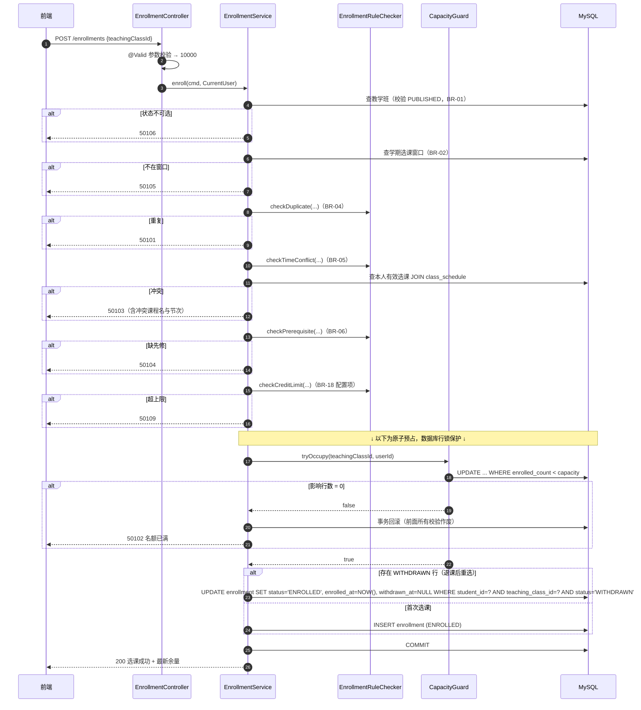

# 03 后端模块设计

| 项 | 值 |
|---|---|
| 上游 | `docs/01`（分层与目录）`docs/02`（表与约束）`docs/05`（接口契约） |
| 下游 | `docs/06` `docs/07` |
| 定位 | 把 `05` 的接口契约翻译成可实现的模块职责、流程与规则 |

---

## 1. 模块清单

| 模块 | 包 | 对应端点 | 核心职责 | 明确不做 |
|---|---|---|---|---|
| `security` | `com.csms.security` | — | JWT 生成/解析、过滤器链、`CurrentUser` 上下文 | 业务鉴权规则 |
| `auth` | `com.csms.auth` | A-01~A-05 | 登录、改密、当前用户档案、权限码装配 | 用户 CRUD（属 `user`） |
| `user` | `com.csms.user` | U-01~U-09 | 用户 CRUD、角色分配、重置密码、启停 | 登录校验 |
| `base` | `com.csms.base` | B-01~B-22 | 院系/专业/学期/课程/先修关系/系统参数 | 教学班 |
| `classroom` | `com.csms.classroom` | C-01~C-14 | 教学班生命周期、上课时间段、名单查询 | 选退课事务 |
| `enroll` | `com.csms.enroll` | E-01~E-07 | **选退课事务与规则校验**（系统核心） | 成绩计算 |
| `grade` | `com.csms.grade` | G-01~G-08 | 成绩录入/计算/发布/解锁 | 学生视角汇总 |
| `stat` | `com.csms.stat` | S-01~S-06 | 只读聚合查询 | 任何写操作 |
| `audit` | `com.csms.audit` | L-01~L-03 | 审计切面、审计查询 | 业务规则 |
| `common` | `com.csms.common` | — | 统一响应、错误码、分页、TraceId、工具 | 任何业务 |

---

## 2. 分层实现约定

### 2.1 对象模型约定

| 对象 | 后缀 | 职责 | 规则 |
|---|---|---|---|
| 实体 | `DO` | 与表一一映射（`MyBatis-Plus` `@TableName`） | 不直接返回给前端 |
| 入参 | `DTO` / `Command` | 接口入参，带 Bean Validation 注解 | 必填/长度/范围注解写在这里 |
| 出参 | `VO` | 面向前端的只读视图 | 字段命名 camelCase；Long → String |
| 枚举 | `*Enum` | 与 `02` §7 注册表一一对应 | 提供 `code()`、`desc()`、`of(code)` |

### 2.2 各层硬性约束

| 层 | 允许 | 禁止 |
|---|---|---|
| Controller | 参数绑定、校验注解触发、调 Service、包装 `ApiResponse` | 任何 `if` 业务分支、直接用 Mapper |
| Service | 业务编排、事务边界、调用 `domain` 校验器 | 直接操作 `HttpServletRequest` |
| domain | 规则判断、计算、状态流转断言 | 访问数据库 |
| Mapper | 单表/联表查询与更新 | 业务分支判断（除非是 `02` §6 的原子 SQL） |

### 2.3 公共约定

| 项 | 约定 |
|---|---|
| 分页 | 入参 `PageQuery{page,size,sortBy,sortOrder}`，出参 `PageResult<T>{records,total,page,size,pages}` |
| 转换 | DO ↔ VO 使用**显式** `Assembler`（手写静态方法），不用反射拷贝工具——避免 `id` 类型/脱敏字段被意外带出 |
| 脱敏 | 手机号/邮箱在 Assembler 内统一处理 |
| TraceId | 入口过滤器生成，写入 MDC + `ThreadLocal`；异步线程需传递 |
| 当前用户 | `CurrentUserHolder`（`ThreadLocal`），登录后由 JWT 过滤器填充，**请求结束时必须 `remove()`** |
| 长事务禁止 | 任何事务方法内**不得**发起 HTTP 调用、文件 IO 或长时间计算 |

---

## 3. 核心模块：`enroll` 选课设计

### 3.1 组件划分

| 组件 | 类型 | 职责 |
|---|---|---|
| `EnrollmentController` | Controller | 暴露 E-01~E-07 |
| `EnrollmentService` | Service | 事务边界持有者、流程编排 |
| `EnrollmentCommandService` | Service | 实际执行"校验 + 原子预占 + 落库"的方法（标 `@Transactional`） |
| `EnrollmentRuleChecker` | domain | **无状态**纯规则校验：重复、时间冲突、先修课、学分上下限 |
| `CapacityGuard` | domain（接口）+ infrastructure（实现） | 封装 `02` §6.2 的原子 UPDATE，返回是否预占成功。domain 层定义 `CapacityGuard` 接口，infrastructure 层提供基于原子 SQL 的实现，Service 通过接口调用，不违反分层铁律 |
| `TimeConflictDetector` | domain | 时间区间相交判定（纯函数，可单测） |

> **拆分理由**：把"规则判断"从"事务编排"里剥出来，使 BR-04/05/06 可以**不启动数据库**做纯单元测试，这正是 `docs/07` §4 用例设计的依据。

### 3.2 节次与分钟换算

后端维护常量映射（示例形式，实现时以学校作息表确认）：

| 节次 | 时间段 | 起始分钟 | 结束分钟 |
|---|---|---|---|
| 1-2 | 08:00–09:50 | 480 | 590 |
| 3-4 | 10:10–12:00 | 610 | 720 |
| 5-6 | 14:00–15:50 | 840 | 950 |
| 7-8 | 16:10–17:00 | 970 | 1020 |

- `day_of_week` + `[start_minute, end_minute]` 作为比较基准，与 `class_schedule` 的冗余字段一致。
- 两段区间相交判定：`aStart < bEnd && bStart < aEnd`。
- 作息表若为可变配置，应改为 `class_schedule` 直接存分钟数（当前已如此设计），换算只用于**表单录入辅助**。

### 3.3 选课时序（核心）

### 3.4 并发控制的四条铁律

| # | 铁律 |
|---|---|
| 1 | 容量判定与自增必须是**同一条** SQL，禁止 `SELECT` 后 `UPDATE` |
| 2 | 事务内对同一教学班的写操作顺序恒为 **teaching_class → enrollment** |
| 3 | 死锁/锁超时异常必须捕获 → 有限重试（2 次，50ms/200ms 抖动）→ 转为 `50112`，**不得抛出 500** |
| 4 | 批量选课（E-06）**逐条独立事务**，一条失败不影响其他；不得把整个批次包进一个大事务 |

### 3.5 退课流程

| 步 | 动作 | 失败码 |
|---|---|---|
| 1 | 按 `id` 或 `teachingClassId` 查本人选课关系 `FOR UPDATE` | 10003 |
| 1.5 | 校验教学班状态为 `PUBLISHED`（`CANCELLED`/`CLOSED` 的班不允许退课） | 40103 |
| 2 | 已 `WITHDRAWN` → 幂等返回成功 | — |
| 3 | 已 `COMPLETED`（已发布成绩）→ 拒绝 | 50107 |
| 4 | 校验退课截止期（BR-08） | 50107 |
| 5 | 校验未开课（`open_class_date > today`，BR-08） | 50108 |
| 6 | 校验退课后学分不低于下限 | 50110 |
| 7 | `status=WITHDRAWN`，`enrolled_count = GREATEST(count-1,0)`，COMMIT | — |

### 3.6 选课预检接口（E-05）

`EnrollmentService.precheck()` 复用与正式选课**完全相同**的 RuleChecker，只是不执行 `CapacityGuard` 与落库。

- 返回 `{canEnroll, reasonCode, reason, conflicts:[{teachingClassId, courseName, schedules[]}]}`。
- **预检结果仅供前端灰显，正式选课的判定永远以服务端为准**（预检存在 TOCTOU 窗口，见 `docs/11` RISK-03）。

---

## 4. 状态机实现

### 4.1 通用状态机工具

设计一个轻量的 `SimpleStateMachine<T>`：`canTransit(from, action)` + `assertTransit(from, action)`，状态与允许动作集中在枚举中定义（映射表见 `02` §7.1）。

| 调用方 | 失败行为 |
|---|---|
| Service | `assertTransit` 抛 `BizException(40103)` |
| Controller | 不做状态判断，只透传异常 |

### 4.2 教学班状态流转细则

| 动作 | 前置 | 目标 | 额外校验 |
|---|---|---|---|
| `CREATE` | (无) | `DRAFT` | 新建时自动拷贝 `course.credit` 至教学班；此后即便课程学分修改，教学班学分亦**不联动**（保住历史一致性） |
| `PUBLISH` | `DRAFT` | `PUBLISHED` | 必须至少有 1 条时间段；容量 > 0 |
| `CLOSE` | `PUBLISHED` | `CLOSED` | 无 |
| `CANCEL` | `DRAFT`/`PUBLISHED` | `CANCELLED` | 有选课记录时必须填写取消原因并通知（本期仅记录） |
| `ROLLBACK_DRAFT` | `PUBLISHED` | `DRAFT` | **仅 ADMIN**；已有选课时禁止（`40102`/`40105`） |

### 4.3 成绩状态流转细则

| 动作 | 前置 | 目标 | 额外 |
|---|---|---|---|
| 发布 | `DRAFT` | `PUBLISHED` | 无空缺成绩（`60102`）；同事务置 `enrollment=COMPLETED` |
| 解锁 | `PUBLISHED` | `DRAFT` | 仅 ADMIN；`reason` 至少 5 字（`60105`）；`unlock_count+1`；写审计 |

---

## 5. 异常体系

### 5.1 异常分类

| 异常 | 用途 | 处理者 |
|---|---|---|
| `BizException(code, message)` | **可预期业务失败** | `GlobalExceptionHandler` → 信封 + 映射 HTTP 码 |
| `ValidationException` | Bean Validation 失败 | 同上 → `10000` + 字段级错误 |
| `AccessDeniedException` | 资源归属不符 | `10002` + HTTP 403 |
| `ResourceNotFoundException` | 资源不存在 | `10003` + HTTP 404 |
| `DuplicateKeyException` | 唯一键冲突 | **必须翻译为对应业务码**（`50101`/`70101`…），禁止外泄 |
| `DeadlockLoserDataAccessException` | 死锁 | 重试后转 `50112` / `10005` |
| 其余 `Exception` | 兜底 | `10006` + HTTP 500，**响应体不含堆栈**，仅记日志与 traceId |

### 5.2 全局异常处理要求

| 要求 | 说明 |
|---|---|
| 单一出口 | 只有一个 `@RestControllerAdvice` 负责产出 `ApiResponse` |
| 不外泄细节 | 响应 `message` 必须是**可展示的中文**，禁止出现 SQL、表名、类名、堆栈 |
| 日志分级 | 4xx → `WARN`；5xx → `ERROR` + 堆栈 |
| 链路可查 | 所有日志行带 `traceId`，5xx 额外记录完整请求参数（敏感字段脱敏） |

### 5.3 日志脱敏清单（强制）

`password` `oldPassword` `newPassword` `accessToken` `refreshToken` `Authorization` `phone` `email` `idCard`

实现方式：统一 `SensitiveConverter`（Jackson `SerializerModifier`）对这些字段做序列化脱敏，**从源头保证不外泄**，而不是依赖每个开发者记得手写。

---

## 6. 安全模块实现要点

| 主题 | 方案 |
|---|---|
| 密码存储 | `BCryptPasswordEncoder(strength=10)` |
| 登录失败锁定 | 失败计数与 `lock_until` 落 `sys_user`；5 次锁 15 分钟（`sys_config` 可调） |
| JWT | HS256；密钥来自配置或环境变量 `CSMS_JWT_SECRET`，**禁止硬编码进仓库** |
| Token 失效 | 短有效期（默认 2h）+ 管理员可强制下线（本期通过 `fail_count` 版本号校验实现，P2） |
| 过滤器链 | `permitAll` 白名单（登录、健康检查、静态资源）→ 其余 `authenticated()` → 角色限制在 `@PreAuthorize` 或方法级校验 |
| 越权防护 | 每个 Service 方法入口先取资源，再比对 `CurrentUser.id` 与资源归属（BR-14） |
| CORS | 开发期仅允许 `localhost:5173`；生产**关闭**（同源部署） |
| CSRF | 无状态 API，关闭 CSRF；但**不使用 Cookie 存 Token**（存 `sessionStorage`/`localStorage`） |
| 上传 | 成绩导入仅接受 `.csv`，大小上限 2MB，MIME 与扩展名双校验，内容不含公式注入 |
| SQL 注入 | 全部走 `#{}` 预编译；动态排序字段走**白名单枚举**映射，禁止字符串拼接 |

---

## 7. 审计切面设计

| 项 | 方案 |
|---|---|
| 挂载点 | `@AuditAction(module=..., action=..., targetType=...)` 注解 + AOP 切面 |
| 采集内容 | 操作人、角色、IP、traceId、目标 ID、执行结果、耗时、变更前后值 |
| 前后值 | 由 Service 显式提供"变更前快照"；切面负责序列化，敏感字段剔除 |
| 写入方式 | 提交后**异步**写（`@Async` + 有界队列 + 拒绝策略为丢弃并计数告警） |
| 失败策略 | 审计失败**不影响**业务事务（RISK-05），但需打 ERROR 日志与 Actuator 指标 |
| 覆盖率 | 选退课、成绩发布/解锁、基础数据增删改、用户变更、登录（A-01/A-02 走 `@AuditAction` 之外的显式记录） |

---

## 8. 统计模块实现

| 接口 | 实现要点 |
|---|---|
| S-01 总览 | 单条聚合 SQL + 少量次级查询；`fillRate = enrolledCount / capacity`，`capacity=0` 时按 0 处理避免除零 |
| S-02 按课程 | `GROUP BY course_id` + `JOIN course`，分页用**子查询分页后再关联**，避免大结果集全量加载 |
| S-04 满员度分析 | 三个 `WHERE` 条件的列表查询：`fillRate=100%` / `<30%` / `30%~90%` |
| S-05 成绩分布 | `CASE WHEN total_score>=90 THEN '90-100' …` 分桶后 `GROUP BY` |
| S-06 学生汇总 | 学分聚合 + 绩点聚合（`SUM(grade_point*credit)/SUM(credit)`，分母为 0 时返回 0） |

**硬约束（FR-STAT-05）**：统计接口**禁止**返回任何硬编码样例数据；本地未初始化数据时返回空集合而非假数据，测试断言"空库返回 0 条"（`10` AC-16）。

---

## 9. 定时任务

| 任务 | 频率 | 职责 |
|---|---|---|
| 名额对账 | 每日 02:00 | 执行 `02` §6.7 对账查询；不一致则写审计 + Actuator 指标 `csms.capacity.mismatch` 置 1 |
| 登录日志清理 | 每日 03:00 | 删除 180 天前 `sys_login_log` |
| 审计归档 | 每周 | 超过 1 年的 `sys_audit_log` 归档到历史表/文件后清理 |
| 学期状态提醒 | 每日 07:00 | 按 `term` 窗口检查应变更的状态，**只提醒不自动改**（避免误改教务数据） |

> 定时任务统一使用 Spring `@Scheduled` + 自建线程池，**不引入 Quartz**（`01` ADR-05 精神：不过度设计）。可通过配置开关关闭。

---

## 10. 配置项清单（`application-*.yml`）

| 配置项 | dev 默认 | 说明 |
|---|---|---|
| `spring.datasource.url` / `username` / `password` | 本机 MySQL | **密码走环境变量**，不入库 |
| `spring.datasource.hikari.maximum-pool-size` | 20 | 选课高峰可调至 50（`06` §2） |
| `spring.datasource.hikari.isolation` | `TRANSACTION_READ_COMMITTED` | 对应 `02` §6.3 |
| `csms.jwt.secret` / `expire-seconds` | 环境变量 / 7200 | |
| `csms.security.captcha-enabled` | false | |
| `csms.enroll.max-retry` | 2 | 死锁重试次数 |
| `csms.audit.async.core-pool-size` / `queue-size` | 2 / 1000 | |
| `csms.scheduled.enabled` | true | |
| `spring.flyway.locations` | `classpath:db/migration` | 生产追加 `-prod` 路径排除演示数据 |
| `management.endpoints.web.exposure.include` | `health,info,metrics` | 生产可仅 `health` |
| `logging.pattern.level` | 含 `%X{traceId}` | |

---

## 11. 实现期自检清单

编码完成后逐条核对：

- [ ] 容量扣减确实是一条 `UPDATE ... WHERE enrolled_count < capacity`，代码中无"先查后改"（`10` AC-06）
- [ ] `DuplicateKeyException` / 死锁异常均已翻译为业务错误码，接口无 500 泄漏
- [ ] 每个资源级接口都做了归属校验（`10` AC-09）
- [ ] 密码、Token 未出现在任何日志与审计快照中（`10` AC-11）
- [ ] 统计接口无硬编码数据（`10` AC-16）
- [ ] 事务方法内无 HTTP/IO 调用
- [ ] `ThreadLocal` 在 `finally` 中清理，无内存泄漏
- [ ] 全部枚举取值与 `02` §7 一致（`10` AC-12）