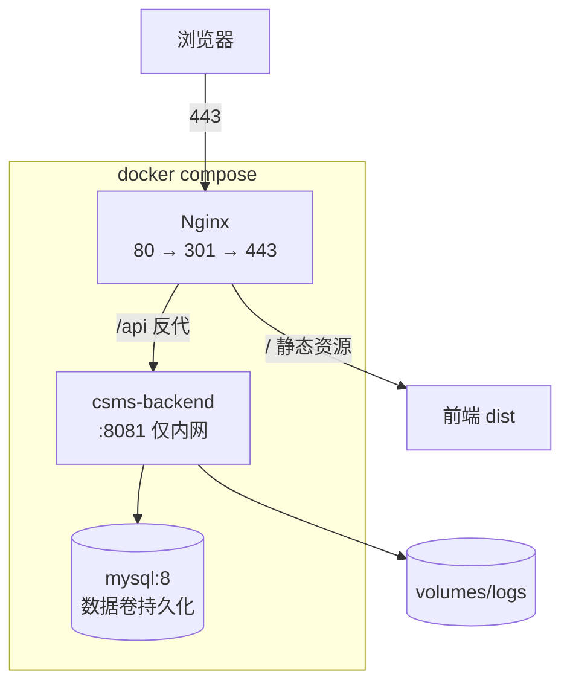

# 08 部署与运维设计

> **授权状态**：**无远程部署授权**。本文档只提供**方案与配置模板**，未执行任何远程部署、未创建任何云资源、未产生任何部署回执。
> 因此本文档任何内容都**不构成"已上线"的证据**。

| 项 | 值 |
|---|---|
| 上游 | `docs/01` §9 `docs/06` |
| 下游 | `docs/10` |

---

## 1. 环境规划

| 环境 | 用途 | 数据 | 触发 | 谁能访问 |
|---|---|---|---|---|
| `dev` | 开发自测 | 频繁重建 | 本地代码 | 开发者本机 |
| `test` | 自动化测试 | Testcontainers 每次全新 | CI | CI Runner |
| `demo` | 演示/答辩 | 稳定种子数据，可一键重置 | 手动发布 | 评审人（需授权） |
| `prod` | 生产 | 真实数据 | 变更审批后发布 | 运维 |

**分层原则**：`test` 用临时容器禁止持久化；`demo` 保留可重置脚本；`prod` 只允许 Flyway 迁移，**不执行演示数据脚本**（`02` §11）。

### 1.1 Windows 开发环境快速指南

在 Windows 环境开发时，应按以下步骤启动联调环境；机器安装路径、服务名和连接凭据必须仅配置在本地：
1. **数据库检查**：通过 Services.msc 确认自行配置的 MySQL 8 服务已启动，或使用原生独立实例。`start-dev-db.bat` 从 `CSMS_MYSQL_HOME` 读取安装目录，从 `CSMS_MYSQL_DATA` 读取已初始化的数据目录；默认数据目录在项目 `.local/` 下。
2. **环境变量**：确保 `JAVA_HOME` 指向 JDK 17（若 JDK 26 存在编译冲突时，回退到 17）。
3. **后端启动**：
   - 进入 `backend` 目录，执行 `./mvnw.cmd spring-boot:run` 启动于 `8081` 端口。
4. **前端启动**：
   - 进入 `frontend` 目录，执行 `pnpm install` 然后 `pnpm dev`。
   - Vite 默认在 `5173` 端口，通过 `vite.config.ts` 的 `server.proxy` 将 `/api` 转发到 `http://localhost:8081` 解决跨域。

---

## 2. 部署拓扑（单台主机即可满足）

| 组件 | 端口 | 暴露范围 |
|---|---|---|
| Nginx | 443/80 | 对外 |
| 后端 | 8081 | **仅内网**，不映射到宿主机公网 |
| MySQL | 3306 | **不对外映射**，仅容器网络内 |

---

## 3. 容器编排（配置模板，未执行）

**docker-compose 服务定义（描述级）**

| 服务 | 镜像/构建 | 关键配置 | 卷 |
|---|---|---|---|
| `mysql` | `mysql:8` | `MYSQL_DATABASE=csms`、`MYSQL_ROOT_PASSWORD`、`command: --character-set-server=utf8mb4 --collation-server=utf8mb4_general_ci` | `mysql-data:/var/lib/mysql` |
| `backend` | 由 `backend/Dockerfile` 构建 | `depends_on: mysql (healthy)`、环境变量注入、`HEALTHCHECK` 探 `/actuator/health` | `app-logs:/app/logs` |
| `frontend` | 由 `frontend/Dockerfile` 构建（多阶段：build → nginx） | 挂载 `nginx.conf` | `frontend-logs` |

**Dockerfile 分层要点**

| 层 | 内容 | 目的 |
|---|---|---|
| 后端 builder | Maven 依赖层（缓存层）+ 打包层 | 依赖不变时不重新下载 |
| 后端 runtime | JRE 精简镜像（非 JDK）、非 root 用户、只读根文件系统 + 日志卷可写 | 安全与体积 |
| 前端 builder | `pnpm install --frozen-lockfile` → `pnpm build` | 锁定依赖 |
| 前端 runtime | `nginx:alpine` + 静态产物 + 配置 | 只做托管与反代 |

**健康检查**

| 服务 | 检查方式 | 重试 |
|---|---|---|
| `mysql` | `mysqladmin ping` | 30 次 × 5s |
| `backend` | `GET /actuator/health` 返回 `UP` | 20 次 × 5s |
| `frontend` | `GET /` 返回 200 | 10 次 × 3s |

---

## 4. 配置与密钥管理

### 4.1 配置分层

| 来源 | 内容 | 是否入库 |
|---|---|---|
| `application.yml` | 非敏感默认值 | ✅ |
| `application-dev.yml` | 本地开发 | ✅（不含真实密码） |
| `application-prod.yml` | 生产结构与开关 | ✅ |
| 环境变量 | 数据库密码、JWT 密钥 | ❌ 绝不 |
| Docker Compose `env_file` | 本机私有 | ❌ 加 `.gitignore` |

### 4.2 必需环境变量

| 变量 | 说明 | 生成要求 |
|---|---|---|
| `CSMS_DB_URL` | JDBC 连接串 | — |
| `CSMS_DB_USERNAME` / `CSMS_DB_PASSWORD` | 数据库账号 | 强密码 |
| `CSMS_JWT_SECRET` | JWT 签名密钥 | **≥32 字节随机值**，部署时生成，禁止沿用默认值 |
| `CSMS_CORS_ALLOWED_ORIGINS` | 开发期前端地址；生产留空 | — |
| `TZ` | 时区，统一 `Asia/Shanghai` | — |

### 4.3 密钥轮换

| 项 | 频率 | 方式 |
|---|---|---|
| JWT 密钥 | 每学期或疑似泄漏时 | 重启生效；旧 Token 全部失效（需通知用户重登） |
| 数据库密码 | 每 6 个月 | 在线修改 |

---

## 5. Nginx 配置模板（前端托管 + 反代）

**要点说明**（以下为配置要素，非可直接执行文件）：

| 配置块 | 关键指令 | 目的 |
|---|---|---|
| `server` (80) | `return 301 https://$host$request_uri;` | 强制 HTTPS |
| `server` (443) | `ssl_certificate` / `ssl_certificate_key` / `ssl_protocols TLSv1.2 TLSv1.3` | TLS |
| 静态资源 | `root /usr/share/nginx/html;` `try_files $uri $uri/ /index.html;` | **SPA history 路由回退** |
| `/api/` | `proxy_pass http://backend:8081;` | 反向代理（同源，无 CORS） |
| 反代头 | `proxy_set_header Host $host;` `X-Real-IP` `X-Forwarded-For` `X-Forwarded-Proto` | 后端取真实 IP 与协议 |
| 超时 | `proxy_read_timeout 60s;` | 批量成绩导入不超时 |
| 上传限制 | `client_max_body_size 5m;` | 与后端限制匹配 |
| 安全头 | `X-Content-Type-Options nosniff`、`X-Frame-Options DENY`、`Referrer-Policy strict-origin-when-cross-origin` | `06` §7 |
| 缓存 | `/assets/*` 长缓存（`Cache-Control: public, max-age=31536000, immutable`）；`index.html` **禁缓存** | 指纹文件长缓存 + 入口不缓存 |
| 限流 | `limit_req_zone` 对 `/api/v1/auth/login` 单独设限 | 配合 `06` §3.4 |
| gzip | 文本类型压缩 | 体积 |

**SPA 路由回退是关键**：`try_files ... /index.html` 缺失会导致前端路由（如 `/student/courses`）刷新 404。

---

## 6. 数据库初始化与数据

### 6.1 迁移执行

| 阶段 | 执行者 | 内容 |
|---|---|---|
| 结构 | 应用启动时 Flyway 自动执行 | `V1__init_schema.sql` 等 |
| 字典/角色 | 同上 | `V2__init_dict_and_role.sql` |
| 基础数据 | 同上 | `V3__init_base_data.sql` |
| 演示数据 | **仅 dev/demo**，生产跳过 | `V4__init_demo_data.sql` |

生产跳过演示数据的方式（两选一，实施时确定）：
1. `spring.flyway.locations` 生产指向不含 `V4` 的目录；
2. `spring.flyway.target=3`（迁移到指定版本为止）。

> 无论哪种方式，**生产库在首次启动后必须核对演示账号已禁用或密码已修改**（`02` §8、`06` §3.1）。

### 6.2 演示数据重置（仅 dev/demo）

- 脚本思路：停止应用 → 重置数据卷或执行清理 SQL → 重新启动。
- **重置前必须确认目标环境变量**，避免误清生产。

### 6.3 备份

| 项 | 策略 |
|---|---|
| 频率 | 每日 03:30 全量 `mysqldump` |
| 保留 | 7 份，异地存放 |
| 校验 | 每月随机抽 1 份恢复到临时库并执行 `02` §6.7 对账 SQL |

---

## 7. 发布流程（方案，未执行）

### 7.1 冒烟验证清单（每次发布后必跑）

| # | 检查 | 判据 |
|---|---|---|
| 1 | `/actuator/health` | `UP` |
| 2 | 首页加载 | 200 且静态资源正常 |
| 3 | 用演示管理员登录 | 成功并跳转到 `/admin/dashboard` |
| 4 | 查教学班列表 | 返回数据，格式正确 |
| 5 | 选一门有余量的课 | 成功，计数 +1 |
| 6 | 选同一门再试 | 拒绝，`code=50101` |
| 7 | 退课 | 成功，计数 -1 |
| 8 | 名额对账接口 | 返回空（一致） |
| 9 | 审计日志 | 能查到刚才的选退课记录 |
| 10 | 前端错误 | 浏览器控制台无报错 |

### 7.2 回滚

| 项 | 策略 |
|---|---|
| 应用回滚 | 镜像标签回退到上一版本（数据无损，纯应用层变更可秒级） |
| 数据库回滚 | **禁止自动回滚 DDL**。Flyway 迁移必须向前兼容：先加列 → 发新代码 → 再清理旧列（三步法），保证旧版本应用可继续运行 |
| 数据恢复 | 仅在数据损坏时用备份恢复，需人工确认且会丢失备份点之后的业务数据 |
| 回滚触发条件 | 健康检查失败 / 5xx 率 > 1% / 核心链路不可用 / `capacity_mismatch > 0` |

---

## 8. CI/CD 方案

### 8.1 流水线阶段（GitHub Actions 或 Gitee Go 均可）

| 阶段 | 动作 | 阻断条件 |
|---|---|---|
| L1 静态检查 | 后端格式/检查、前端 ESLint + `vue-tsc` | 有 error |
| L2 单元测试 | 后端单测（含覆盖率）、前端单测 | 任一失败 |
| L3 集成测试 | Testcontainers 起 MySQL 跑 `07` §4 全量 | 任一失败 |
| L4 构建 | 打包 jar、前端 build | 构建失败 |
| L5 契约校验 | 响应信封/错误码集合断言（TC-A-20~27） | 不一致 |
| L6 安全扫描 | OWASP dependency-check、`pnpm audit` | 存在高危 |
| L7 镜像构建 | 构建并打版本标签 | 失败 |
| L8 部署（仅 demo） | 需**手动审批**后执行 | — |

> **prod 部署不在自动流水线内**，必须人工审批 + 变更单（`docs/08` 授权边界）。

### 8.2 文档一致性检查（可选 P2）

在 L1 增加"契约漂移检查"：比对 `docs/05` 的错误码表与代码枚举、比对 `docs/02` 表清单与 Flyway 脚本中的建表语句。不一致即失败，防止文档腐化。

---

## 9. 监控与日志运维

| 项 | 方案 |
|---|---|
| 应用日志 | 容器内 `/app/logs/app.log`，挂载到宿主目录，`logrotate` 按天滚动保留 30 天 |
| 审计日志 | 数据库表，归档任务见 `03` §9 |
| 指标 | `/actuator/metrics` 由抓取器采集（Prometheus 可选，P2） |
| 健康检查 | 容器 `HEALTHCHECK` + 外部探活 |
| 告警 | `06` §5.2 的规则接入告警通道（本期只定义指标，接入需授权） |

---

## 10. 常见故障排查手册

| 现象 | 可能原因 | 排查步骤 |
|---|---|---|
| 前端刷新 404 | Nginx 缺 SPA 回退 | 检查 `try_files` |
| 登录后接口 401 | Token 未注入 / 过期 | 看浏览器 Network 的请求头；查 `exp` |
| 跨域报错 | 开发期代理未生效 / 生产错开 CORS | 检查 Vite `server.proxy`；生产应同源 |
| 启动即失败：Flyway checksum | 迁移脚本被本地改过 | 本地执行 `flyway repair`；**禁止**在生产直接改 |
| 选课返回 50112 | 死锁重试耗尽 | 看 `csms.deadlock.retry` 指标；确认隔离级别为 RC |
| 选课后余量不对 | 计数与真实不一致 | 立即执行 `Y-02` 对账接口；查 `csms.rollback` 指标 |
| 成绩发布报错 60102 | 有空缺 | 核对名单中的 null 成绩 |
| 数据库连不上 | 容器健康检查未通过 | `docker compose ps`；查 `mysqladmin ping` |

---

## 11. 部署前检查清单

发布到 `demo` 前逐项确认：

- [ ] CI 全绿（L1~L7）
- [ ] 已备份当前数据库
- [ ] `CSMS_JWT_SECRET` 已是本次生成的新值
- [ ] 演示账号密码已修改或已禁用
- [ ] `flyway.target` 设置正确（生产不含演示数据）
- [ ] Nginx 配置已通过 `nginx -t`
- [ ] 健康检查通过
- [ ] §7.1 冒烟清单 10 项全过
- [ ] 回滚镜像标签已确认存在
- [ ] 已记录发布版本号与时间（部署回执）

---

## 12. 如实声明

| 声明 | 状态 |
|---|---|
| 是否已执行任何远程部署 | **否**（无授权） |
| 是否产生部署回执 | **否** |
| 是否有上线观察证据 | **否** |
| Compose/Nginx 配置是否在本环境验证过 | **否**（无实现可验证） |
| 可否声称"已上线" | **否**。当前仅有设计与配置模板 |
