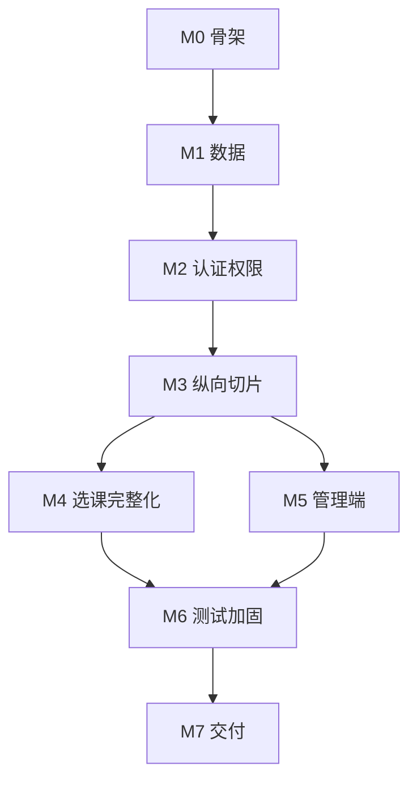

# 09 实施计划与里程碑

> **当前状态：方案设计完成，编码未授权、未开始**（`.ai/TASKS.md` 阶段 C 全部未启动）。

| 项 | 值 |
|---|---|
| 上游 | `docs/03` `docs/04` `docs/07` |
| 下游 | `docs/10` |

---

## 1. 里程碑总览

| 里程碑 | 名称 | 工期(人日) | 产出 | 出口门禁 |
|---|---|---|---|---|
| **M0** | 技术预研与骨架 | 3 | 前后端能启动、前端组件能力验证 | 本机 `mvn -v` / `pnpm dev` 通；**AS-03 结论落地** |
| **M1** | 数据基座 | 3 | 15 张表 + 迁移 + 种子数据 | Flyway 迁移成功；种子数据齐全 |
| **M2** | 认证与权限 | 3 | 登录、JWT、RBAC、审计 | 三角色登录与越权用例通过 |
| **M3** | **最小纵向切片** | 4 | 建课 → 开班 → 选课 → 录成绩 → 发布 | **§2 验收全绿** |
| **M4** | 选课完整化与前端 | 6 | 三重校验、退课、课表、成绩、统计 | `07` §4 全绿 |
| **M5a** | 基础数据管理 | 3 | 用户/院系/学期/课程 | 页面全可用（可与 M4 并行） |
| **M5b** | 业务管理与报表 | 2 | 教学班管理/报表/审计 | 报表数据准确（依赖 M4） |
| **M6** | 测试与加固 | 5 | 全量测试、性能、限流、备份 | 覆盖率门禁达标 |
| **M7** | 交付与演示 | 3 | 部署方案落地、文档、答辩材料 | 冒烟清单全过 |
| — | **合计** | **32 人日** | | 单人全职约 6~7 周 |

工期估算前提：1 名开发者（熟悉 Spring Boot 与 Vue）、不含需求变更。**这是估算不是承诺**。

---

## 2. 最小纵向切片定义（**M3 的核心，也是整个项目的起手式**）

> **原则：宁可一条链路端到端打通，不做十个模块的空壳。**

### 2.1 切片范围

一条真实的、可演示的业务链路：

### 2.2 切片内的技术要素（必须真实，非 mock）

| 要素 | 要求 |
|---|---|
| 数据库 | 独立真实 MySQL 开发或测试实例，Flyway 建表；当前测试禁止启动 Docker |
| 认证 | 真实 JWT 签发与校验，真实 BCrypt 密码 |
| 选课 | **真实原子 SQL**，必须能演示"最后一个名额被抢" |
| 权限 | 真实角色隔离，演示学生访问管理接口被拒 |
| 前端 | 真实页面 + 真实 HTTP，**不做 mock 数据** |
| 审计 | 真实写 `sys_audit_log`，演示后台可查 |
| 统计 | 数字全部来自库，不允许写死 |

### 2.3 切片涉及表（最小集）

`sys_user` `sys_role` `sys_user_role` `dept` `term` `course` `teaching_class` `class_schedule` `enrollment` `grade` `sys_audit_log`
（M3 阶段暂不建：`major`、`course_prereq`、`sys_login_log`、`sys_config` 的完整实现，M4/M5 补齐；**表结构可一次建全，逻辑后补**。）

### 2.4 切片完成判定（逐条可执行）

| # | 判定条件 | 验证方式 |
|---|---|---|
| 1 | `mvn spring-boot:run` 启动成功且无异常日志 | 控制台输出 |
| 2 | `pnpm dev` 启动并可访问登录页 | 浏览器截图 |
| 3 | 管理员建课程 + 开班成功 | 库中 `course`/`teaching_class` 有行 |
| 4 | 教学班状态为 `PUBLISHED` | 接口返回 + 库一致 |
| 5 | 学生选课成功 | `enrollment` 有行，`enrolled_count=1` |
| 6 | 同一学生再选同班被拒 `50101` | 接口响应 + 库无新行 |
| 7 | 容量设为 1 时第二个学生被拒 `50102` | 接口响应 + 计数仍为 1 |
| 8 | 教师登录可见该教学班 | 页面 + 接口 |
| 9 | 教师录入并保存成绩 | `grade` 有行且 `total_score` 由后端算出 |
| 10 | 发布成绩 | `grade.status=PUBLISHED` 且 `enrollment.status=COMPLETED` |
| 11 | 学生看到已发布成绩 | 接口返回 `PUBLISHED` 记录 |
| 12 | 学生访问 `/api/v1/users` 返回 403 | curl 证据 |
| 13 | 审计后台能查到上述操作 | 页面 + 库 |
| 14 | 全链路可在 10 分钟内从零重跑一遍 | 录屏或步骤清单 |

> **第 14 条是切片的真正意义**：证明这套系统是可运行的，不是 PPT。

### 2.5 切片期间允许的简化（明示，不隐瞒）

| 允许省略 | 说明 | 何时补 |
|---|---|---|
| 课程先修关系校验（BR-06） | 切片不演示 | M4 |
| 时间冲突校验（BR-05） | 切片不演示 | M4 |
| 学分上下限（50109/50110） | 切片不演示 | M4 |
| 统计报表页面 | 切片只保留概览数字 | M5 |
| 登录锁定、限流 | — | M6 |

**不允许省略**：认证授权、容量原子性、数据隔离、审计、真实数据库。

---

## 3. 里程碑详细拆解

### M0 技术预研与骨架（3 人日）

| # | 任务 | 产出 |
|---|---|---|
| 0.1 | 后端骨架：Spring Boot 3.x + Web + Validation + MyBatis-Plus + Flyway | `backend/` 可启动 |
| 0.2 | JDK 版本裁决（AS-04：26 / 21 / 17） | 决策记录 |
| 0.3 | 前端骨架：Vite + Vue 3 + TS + Router + Pinia + Axios | `frontend/` 可启动 |
| 0.4 | **AS-03 裁决**：验证 Nuxt UI 能否在纯 Vite 项目接入 | 结论 + 落地或回退 |
| 0.5 | 组件能力验证清单（`04` §6.3 逐个确认存在） | 组件映射表定稿 |
| 0.6 | 统一响应、错误码枚举、TraceId、异常处理器 | 公共层 |
| 0.7 | 与后端联调通路：Vite 代理 + 一个 `/health` 打通 | 端到端 hello |

**门禁**：`04` §6.3 的组件全部可用或已完成降级映射；`/api/v1/health` 经 Vite 代理返回 200。

### M1 数据基座（3 人日）

| # | 任务 |
|---|---|
| 1.1 | 按 `02` §5 写全部 15 张表的迁移脚本 |
| 1.2 | 索引与字符集核对（逐条对照 `02` §9） |
| 1.3 | 枚举 Java 类（对照 `02` §7） |
| 1.4 | 种子数据：角色、系统参数、院系、学期、课程 |
| 1.5 | 演示数据（用户、教学班、上一学期选课成绩） |
| 1.6 | 对账 SQL 可执行且返回 0 行 |

**门禁**：干净库执行迁移一次成功；重复执行不报错；种子数据齐全。

### M2 认证与权限（3 人日）

| # | 任务 |
|---|---|
| 2.1 | BCrypt + JWT 签发/校验 + 安全过滤器链 |
| 2.2 | 登录接口、当前用户、改密 |
| 2.3 | `@PreAuthorize` 与方法级归属校验工具 |
| 2.4 | 审计切面 |
| 2.5 | 登录日志 + 失败锁定（基础版） |
| 2.6 | 前端登录页、路由守卫、`v-perm` |
| 2.7 | 越权用例 `TC-A-10 ~ TC-A-17` |

**门禁**：三角色登录可用；全部越权用例通过；审计可查。

### M3 最小纵向切片（4 人日）— §2

**门禁**：§2.4 的 14 条全绿，且可在 10 分钟内重跑。

### M4 选课完整化与前端（6 人日）

| # | 任务 |
|---|---|
| 4.1 | `EnrollmentRuleChecker`：重复、时间冲突、先修课、学分上下限（纯单元测试） |
| 4.2 | 并发用例 `TC-I-20 ~ TC-I-26` |
| 4.3 | 退课全流程与幂等 |
| 4.4 | 选课预检接口 E-05 |
| 4.5 | 前端：课程选择页（核心页）、我的课表、我的成绩 |
| 4.6 | 成绩录入表（实时总评预览）、发布与解锁弹窗 |
| 4.7 | 教师端教学班列表、名单页 |
| 4.8 | 统计接口 S-01~S-05 |

### M5a 基础数据管理（3 人日）

| # | 任务 |
|---|---|
| 5.1 | 用户管理（CRUD、重置密码、角色、启停） |
| 5.2 | 院系/专业/学期管理 |
| 5.3 | 课程管理与先修关系编辑（含成环拦截） |
| 5.4 | 审计日志、登录日志、系统参数页 |

### M5b 业务管理与报表（2 人日）

| # | 任务 |
|---|---|
| 5.5 | 教学班管理与状态流转 |
| 5.6 | 概览看板与统计报表页 |

### M6 测试与加固（5 人日）

| # | 任务 |
|---|---|
| 6.1 | 补齐单元测试至门禁覆盖率 |
| 6.2 | 接口测试 TC-A-20~27 自动化 |
| 6.3 | 前端 E2E（Playwright）12 条 |
| 6.4 | 安全测试 TC-S-01~11 |
| 6.5 | 限流、超时、索引复核 |
| 6.6 | 压测（生成数据集 + `07` §8） |
| 6.7 | 依赖漏洞扫描 |

### M7 交付与演示（3 人日）

| # | 任务 |
|---|---|
| 7.1 | Docker Compose 与 Nginx（按 `08`） |
| 7.2 | 部署到 demo 环境并执行冒烟清单 |
| 7.3 | README、接口文档、演示脚本 |
| 7.4 | 答辩 PPT/演示视频 |
| 7.5 | 文档与实现一致性复核 |

---

## 4. 任务依赖关系

**关键路径**：M0 → M1 → M2 → M3 → M4 → M6 → M7（M5 可与 M4 并行）。

---

## 5. 排期建议（单人全职，周为单位）

| 周 | 内容 |
|---|---|
| W1 | M0 + M1 |
| W2 | M2 + M3 前半 |
| W3 | M3 后半（切片验收） |
| W4-5 | M4 |
| W5-6 | M5（与 M4 部分并行） |
| W6-7 | M6 |
| W7 | M7 |

---

## 6. 优先级取舍原则（工期紧张时按此砍）

| 优先保 | 可延后 | 理由 |
|---|---|---|
| 认证授权、容量原子性 | 统计报表 | 正确性与安全性不可妥协 |
| 选退课主流程 | 课程先修校验（BR-06） | BR-06 是加分项非核心 |
| 成绩录入与发布 | 成绩批量导入（P2） | 导入非必需 |
| 时间冲突校验 | 学分上下限 | 冲突校验更有演示价值 |
| 审计 | 登录日志看板 | 审计是可追溯底线 |
| 前端课程选择页 | 管理端图表美化 | 主界面体验权重高 |

---

## 7. 每个里程碑的证据要求

每次里程碑结束，必须产出一份**可复核的证据**（`docs/evidence/<里程碑>-<日期>.md`）：

| 证据类型 | 要求 |
|---|---|
| 构建/启动日志 | 关键片段（成功行 + 无 ERROR） |
| 接口样例 | 请求与响应（脱敏） |
| 数据库查询 | 关键表的 `SELECT` 结果 |
| 页面截图 | 核心页面 |
| 测试报告 | 通过数/失败数/覆盖率 |
| 并发测试 | 线程数、成功数、失败数、计数一致性结论 |

> **没有证据的"已完成"不予采信。**

---

## 8. 计划风险

| 风险 | 影响 | 应对 |
|---|---|---|
| AS-03 证伪（Nuxt UI 无法接入 Vite） | M0 +2~3 天 | `04` §1 已给回退方案；M0 第 0.4 项提前验证，避免后期返工 |
| 工期低估 | M6/M7 被压缩 | 按 §6 取舍；优先保核心闭环 |
| 并发问题晚暴露 | M4 返工 | M3 就必须做并发用例，不留到 M6 |
| 依赖下载慢（国内网络） | 全程效率 | Maven 配镜像源；pnpm 配 registry 镜像 |
| 需求变更（培养方案/排课） | 大幅返工 | 明确范围外清单 `00` §9；变更走影响评估 |
